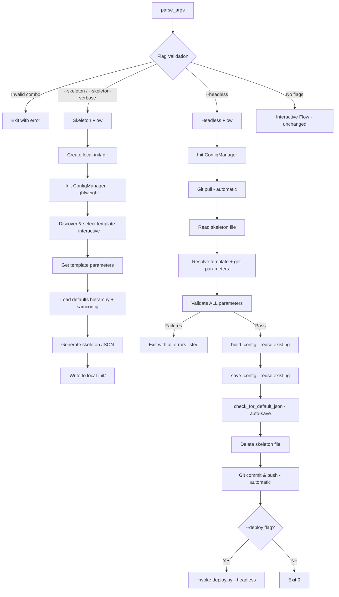

# Design Document: Headless Skeleton Mode

## Overview

This design adds two non-interactive execution modes to `cli/config.py` and a headless mode to `cli/deploy.py`, enabling CI/CD pipelines to configure and deploy infrastructure without human interaction.

The workflow is two-phase:
1. **Skeleton generation** (`--skeleton` / `--skeleton-verbose`): Produces a pre-populated JSON file in `local-init/` that mirrors the internal config structure. The user (or automation) edits parameter values offline.
2. **Headless execution** (`--headless`): Reads the skeleton file, validates all parameters against template constraints, generates the samconfig, performs git operations, and optionally triggers deployment.

The design preserves the existing interactive flow as the default path and introduces branching at the top of `main()` based on flag detection.

## Architecture



### Key Design Decisions

1. **Flag validation before initialization**: Mutual exclusivity checks happen in `parse_args()` or immediately after, before any AWS session is created. This avoids unnecessary credential prompts for invalid invocations.

2. **Reuse of existing methods**: `build_config()`, `save_config()`, `validate_parameter()`, `read_samconfig()`, `get_template_parameters()`, and `discover_templates()` are reused without modification. The skeleton and headless flows compose these existing building blocks differently.

3. **Skeleton file as contract**: The skeleton JSON structure mirrors `build_config()` output exactly, making it trivial to feed back into the headless flow. No format translation is needed.

4. **Git operations via new static methods on `Git` class**: `Git.headless_git_pull()` and `Git.headless_git_commit_and_push()` provide non-interactive variants that raise on failure instead of prompting.

5. **Template reference with versionId**: The skeleton stores the full S3 URI including `?versionId=...` for S3 templates (capturing the version at skeleton generation time), and just the filename for local templates. During headless execution, if `applyTemplateUpdateIfAvailable == "y"`, `get_latest_version_id()` checks for a newer version and uses it; if `"n"`, the versionId from the skeleton is used as-is.

6. **Stage-aware file naming**: Skeleton files include `stage_id` in the filename for `pipeline` and `network` infra types (which always have a stage), but omit it for `storage` and `service-role` (which use `default`).

7. **deploy.py headless mode**: Adds `--headless` flag that suppresses all prompts, forces `confirm_changeset=false`, and performs automatic git operations. It does NOT read skeleton files — it reads samconfig directly.

## Components and Interfaces

### Modified: `parse_args()` in `cli/config.py`

New optional flags added to the argparse parser:

```python
parser.add_argument('--skeleton', action='store_true', default=False,
    help='Generate a skeleton configuration file for headless mode')
parser.add_argument('--skeleton-verbose', action='store_true', default=False,
    help='Generate skeleton with parameter metadata (descriptions, constraints)')
parser.add_argument('--headless', action='store_true', default=False,
    help='Run in headless mode using a skeleton file (no prompts)')
parser.add_argument('--deploy', action='store_true', default=False,
    help='Trigger deployment after headless configuration (requires --headless)')
```

**Validation logic** (executed immediately after `parse_args()` returns):

```python
def validate_mode_flags(args):
    """Validate mutual exclusivity of mode flags. Exit on conflict."""
    skeleton_mode = args.skeleton or args.skeleton_verbose
    if skeleton_mode and args.headless:
        sys.exit("Error: --skeleton/--skeleton-verbose and --headless are mutually exclusive")
    if args.check_stack and (skeleton_mode or args.headless):
        sys.exit("Error: --check-stack is incompatible with --skeleton/--skeleton-verbose/--headless")
    # --skeleton + --skeleton-verbose = treat as --skeleton-verbose
    if args.skeleton and args.skeleton_verbose:
        args.skeleton = False  # skeleton_verbose subsumes skeleton
```

### Modified: `main()` in `cli/config.py`

The main function gains a three-way branch after flag validation:

```python
def main():
    args = parse_args()
    validate_mode_flags(args)

    if args.skeleton or args.skeleton_verbose:
        return run_skeleton_mode(args)
    elif args.headless:
        return run_headless_mode(args)
    else:
        # Existing interactive flow (unchanged)
        ...
```

### New: `run_skeleton_mode(args)` — Top-level function

Orchestrates skeleton generation:

1. Initialize `ConfigManager` (full init — needs AWS for S3 template discovery)
2. Discover templates and prompt user for selection (only interactive step)
3. Get template parameters via `get_template_parameters()`
4. Load defaults hierarchy and existing samconfig
5. Compute pre-populated values
6. Build skeleton dict
7. Check for existing file, prompt overwrite if needed
8. Write JSON to `local-init/`

### New: `run_headless_mode(args)` — Top-level function

Orchestrates headless execution:

1. Initialize `ConfigManager`
2. `Git.headless_git_pull()` — exits on failure
3. Read and parse skeleton file from `local-init/`
4. Resolve template (if `applyTemplateUpdateIfAvailable == "y"`, call `get_latest_version_id()` to check for newer version; if `"n"`, use the versionId from skeleton as-is)
5. Get template parameters via `get_template_parameters()`
6. Validate ALL parameters — collect all errors, exit if any
7. Validate atlantis deploy parameters (s3_bucket, region, role_arn, confirm_changeset)
8. Call `build_config()` with pre-validated values (bypassing interactive prompts)
9. Call `save_config()`
10. Auto-save defaults (equivalent to `check_for_default_json` with "yes" answers)
11. Delete skeleton file
12. `Git.headless_git_commit_and_push()` — exits on failure
13. If `--deploy`: invoke `deploy.py --headless` via subprocess

### New: `ConfigManager.generate_skeleton()` method

```python
def generate_skeleton(self, template_file: str, parameter_groups: List, 
                      parameters: Dict, verbose: bool = False) -> Dict:
    """
    Generate a skeleton configuration dictionary.
    
    Args:
        template_file: Selected template (full S3 URI with versionId, or local filename)
        parameter_groups: Parameter groups from template
        parameters: Template parameter definitions
        verbose: If True, include parameter metadata section
    
    Returns:
        Dict: Skeleton structure ready for JSON serialization
    """
```

This method:
- Loads existing samconfig via `read_samconfig()` if available
- Merges defaults hierarchy via `DefaultsLoader.load_defaults()`
- Applies `calculate_stage_defaults()` for stage-derived values
- Stores the full S3 URI with versionId for S3 templates
- Filters tags to only user-editable ones (using `TagUtils.is_atlantis_reserved_tag()`)
- Optionally builds parameter metadata from template parameter definitions

### New: `ConfigManager.validate_all_parameters()` method

```python
def validate_all_parameters(self, skeleton: Dict, parameters: Dict) -> List[Dict]:
    """
    Validate all parameter values from skeleton against template constraints.
    
    Args:
        skeleton: Parsed skeleton file content
        parameters: Template parameter definitions
    
    Returns:
        List[Dict]: List of validation failures, each with keys:
            - parameter: parameter name
            - value: provided value
            - reason: constraint violation description
        Empty list means all valid.
    """
```

This method iterates over all `parameter_overrides` in the skeleton, calls the existing `validate_parameter()` for each, and collects all failures rather than stopping at the first.

### New: `ConfigManager.validate_atlantis_deploy_params()` method

```python
def validate_atlantis_deploy_params(self, atlantis_params: Dict) -> List[Dict]:
    """
    Validate atlantis deploy parameters (s3_bucket, region, role_arn, confirm_changeset).
    
    Returns:
        List[Dict]: Validation failures with parameter, value, reason keys.
    """
```

Reuses the same validation logic from `gather_atlantis_deploy_parameters()` but without prompting.

### New: `ConfigManager.get_skeleton_file_path()` method

```python
def get_skeleton_file_path(self) -> Path:
    """
    Get the skeleton file path based on infra_type naming rules.
    
    Returns:
        Path: e.g. local-init/acme-myproject-dev-pipeline.json
              or   local-init/acme-myproject-storage.json
    """
    script_dir = Path(__file__).resolve().parent
    local_init_dir = script_dir.parent / "local-init"
    
    if self.infra_type in ['pipeline', 'network']:
        filename = f"{self.prefix}-{self.project_id}-{self.stage_id}-{self.infra_type}.json"
    else:
        filename = f"{self.prefix}-{self.project_id}-{self.infra_type}.json"
    
    return local_init_dir / filename
```

### Modified: `Git` class in `cli/lib/gitops.py`

Two new static methods:

```python
@staticmethod
def headless_git_pull() -> None:
    """Perform git pull without prompting. Raises SystemExit on failure."""
    try:
        result = subprocess.run(
            ['git', 'pull'], capture_output=True, text=True, check=True
        )
        Log.info("Git pull completed successfully (headless)")
    except subprocess.CalledProcessError as e:
        Log.error(f"Git pull failed (headless): {e.stderr}")
        sys.exit(f"Error: git pull failed: {e.stderr}")

@staticmethod
def headless_git_commit_and_push(commit_message: str) -> None:
    """Perform git add, commit, push without prompting. Raises SystemExit on failure."""
    try:
        subprocess.run(['git', 'add', '.'], check=True, capture_output=True, text=True)
        
        result = subprocess.run(
            ['git', 'diff', '--cached', '--quiet'], capture_output=True
        )
        if result.returncode == 0:
            Log.info("No changes to commit (headless)")
            return
        
        subprocess.run(
            ['git', 'commit', '-m', commit_message],
            check=True, capture_output=True, text=True
        )
        subprocess.run(
            ['git', 'push'], check=True, capture_output=True, text=True
        )
        Log.info("Git commit and push completed (headless)")
    except subprocess.CalledProcessError as e:
        Log.error(f"Git operation failed (headless): {e.stderr}")
        sys.exit(f"Error: git {e.cmd[1]} failed: {e.stderr}")
```

### Modified: `deploy.py`

**New flag in `parse_args()`:**

```python
parser.add_argument('--headless', action='store_true', default=False,
    help='Run in headless mode: suppress prompts, auto git ops, force confirm_changeset=false')
```

**Modified `main()` flow:**

```python
def main() -> int:
    args = parse_args()

    if args.headless:
        Git.headless_git_pull()
    else:
        Git.prompt_git_pull()

    deployer = TemplateDeployer(...)

    try:
        template_url = deployer.get_template_from_config()

        # In headless mode, override confirm_changeset
        if args.headless:
            deployer.override_confirm_changeset = True

        exit_code = deployer.deploy_with_temp_template(template_url)

        if exit_code == 0:
            deployer.enable_stack_termination_protection()
            commit_message = f"Deployed {args.infra_type} {args.prefix}-{args.project_id}"
            if args.stage_id:
                commit_message += f"-{args.stage_id}"

            if args.headless:
                Git.headless_git_commit_and_push(commit_message)
            else:
                Git.git_commit_and_push(commit_message)

        return exit_code
    except ...:
        ...
```

**Modified `_run_sam_deploy()`:** When `self.override_confirm_changeset` is True, append `--no-confirm-changeset` to the SAM CLI command.

### Modified: EPILOG in `cli/config.py`

```python
EPILOG = """
Supports both AWS SSO and IAM credentials.
...

Modes:
    Interactive (default):
        config.py <infra_type> <prefix> <project_id> [<stage_id>]

    Skeleton Generation:
        config.py <infra_type> <prefix> <project_id> [<stage_id>] --skeleton
        config.py <infra_type> <prefix> <project_id> [<stage_id>] --skeleton-verbose

    Headless Execution:
        config.py <infra_type> <prefix> <project_id> [<stage_id>] --headless
        config.py <infra_type> <prefix> <project_id> [<stage_id>] --headless --deploy

Workflow:
    1. Generate skeleton:  config.py pipeline acme myapp dev --skeleton-verbose
    2. Edit skeleton:      vi local-init/acme-myapp-dev-pipeline.json
    3. Run headless:       config.py pipeline acme myapp dev --headless --deploy

Notes:
    --skeleton/--skeleton-verbose and --headless are mutually exclusive.
    --check-stack is incompatible with --skeleton, --skeleton-verbose, and --headless.
    --deploy only takes effect when paired with --headless.
    --skeleton-verbose includes parameter descriptions and constraints in the skeleton.
    If both --skeleton and --skeleton-verbose are provided, --skeleton-verbose wins.
"""
```

## Data Models

### Skeleton File JSON Structure

The skeleton file lives at `local-init/{prefix}-{project_id}-[{stage_id}-]{infra_type}.json`.

**Example: `local-init/acme-myapp-dev-pipeline.json`**

```json
{
  "atlantis": {
    "deploy": {
      "parameters": {
        "template_file": "s3://63klabs/atlantis/templates/v2/pipeline/cfn-pipeline.yml?versionId=abc123def456",
        "s3_bucket": "cf-asdf-deployments",
        "region": "us-east-2",
        "capabilities": "CAPABILITY_NAMED_IAM",
        "confirm_changeset": true,
        "role_arn": "arn:aws:iam::123456789012:role/sam-pipeline-role"
      }
    }
  },
  "applyTemplateUpdateIfAvailable": "y",
  "deployments": {
    "dev": {
      "deploy": {
        "parameters": {
          "stack_name": "acme-myapp-dev-pipeline",
          "s3_prefix": "acme-myapp-dev-pipeline",
          "parameter_overrides": {
            "Prefix": "acme",
            "ProjectId": "myapp",
            "StageId": "dev",
            "DeployEnvironment": "DEV",
            "RepositoryBranch": "dev",
            "CodeCommitBranch": "dev",
            "RolePath": "/sam-app/",
            "ServiceRolePath": "/sam-svc/",
            "S3BucketNameOrgPrefix": "xcme",
            "S3ArtifactsBucket": "cf-asdf-deployments",
            "ParameterStoreHierarchy": "/sam-apps/",
            "PermissionsBoundaryArn": "arn:aws:iam::123456789012:policy/MyPermissionsBoundary"
          },
          "tags": {
            "Owner": "",
            "Creator": "",
            "CostCenter": ""
          }
        }
      }
    }
  }
}
```

**Example with verbose metadata: `local-init/acme-myapp-dev-pipeline.json`**

When `--skeleton-verbose` is used, an additional top-level `_parameter_metadata` key is included:

```json
{
  "atlantis": { "..." : "..." },
  "applyTemplateUpdateIfAvailable": "y",
  "deployments": { "..." : "..." },
  "_parameter_metadata": {
    "Prefix": {
      "Type": "String",
      "Description": "Organization prefix for resource naming",
      "AllowedPattern": "^[a-z][a-z0-9]{1,7}$",
      "ConstraintDescription": "2-8 lowercase alphanumeric, starting with letter",
      "MinLength": 2,
      "MaxLength": 8
    },
    "ProjectId": {
      "Type": "String",
      "Description": "Project identifier",
      "MinLength": 1,
      "MaxLength": 32
    },
    "StageId": {
      "Type": "String",
      "Description": "Deployment stage identifier",
      "AllowedValues": ["dev", "test", "beta", "stage", "prod"]
    },
    "DeployEnvironment": {
      "Type": "String",
      "Description": "Deployment environment classification",
      "Default": "DEV",
      "AllowedValues": ["DEV", "TEST", "PROD"]
    },
    "RolePath": {
      "Type": "String"
    }
  }
}
```

### Skeleton File Structure Rules

| Field | Description |
|-------|-------------|
| `atlantis.deploy.parameters.template_file` | Full S3 URI with versionId for S3 templates; filename only for local templates |
| `atlantis.deploy.parameters.role_arn` | Only present for `pipeline` and `storage` infra types |
| `applyTemplateUpdateIfAvailable` | `"y"` or `"n"` — when `"y"`, headless mode checks for a newer versionId and uses it; when `"n"`, uses the versionId stored in the skeleton |
| `deployments` | Contains exactly ONE stage key matching the `stage_id` argument |
| `deployments.{stage}.deploy.parameters.tags` | Dict format `{"Key": "Value"}` — only user-editable tags |
| `_parameter_metadata` | Only present when `--skeleton-verbose` is used; keyed by parameter name |

### Tag Filtering Logic

During skeleton generation, tags are filtered:

```python
def get_user_editable_tags(self, all_tags: List[Dict]) -> Dict:
    """Filter tags to only user-editable ones for skeleton file."""
    return {
        tag['Key']: tag['Value']
        for tag in all_tags
        if not TagUtils.is_atlantis_reserved_tag(tag['Key'])
    }
```

Tags in the skeleton use a flat `{"Key": "Value"}` dict format for easy editing, rather than the `[{"Key": k, "Value": v}]` list format used internally.

### Headless Mode `build_config()` Integration

In headless mode, `build_config()` is called with a modified approach:
- Instead of calling `gather_atlantis_deploy_parameters()` (which prompts), the headless flow passes pre-validated atlantis params directly
- A new wrapper method `build_config_headless()` handles this:

```python
def build_config_headless(self, infra_type: str, template_file: str,
                          atlantis_params: Dict, parameter_values: Dict,
                          tags: List[Dict], local_config: Dict) -> Dict:
    """
    Build config without interactive prompts.
    Mirrors build_config() but skips gather_atlantis_deploy_parameters().
    """
```

This method reuses the same config assembly logic (stack_name generation, tag merging via `generate_tags()`, deployment structure) but takes pre-validated inputs.


## Correctness Properties

*A property is a characteristic or behavior that should hold true across all valid executions of a system — essentially, a formal statement about what the system should do. Properties serve as the bridge between human-readable specifications and machine-verifiable correctness guarantees.*

### Property 1: Skeleton file path follows infra_type naming rules

*For any* valid combination of prefix, project_id, stage_id, and infra_type, the skeleton file path SHALL include stage_id in the filename when infra_type is "pipeline" or "network", and SHALL exclude stage_id from the filename when infra_type is "storage" or "service-role".

**Validates: Requirements 2.3, 6.1**

### Property 2: Skeleton structure contains exactly one stage

*For any* generated skeleton dictionary, the `deployments` key SHALL contain exactly one entry, and that entry's key SHALL equal the stage_id argument provided to the generator.

**Validates: Requirements 2.10, 3.4**

### Property 3: Template reference includes versionId for S3 URIs

*For any* S3 URI returned by template selection (which includes `?versionId=xyz`), the skeleton's `template_file` field SHALL preserve the full URI including the versionId. *For any* local template path, the skeleton's `template_file` field SHALL equal only the filename component.

**Validates: Requirements 2.6**

### Property 4: Pre-population merge precedence

*For any* parameter that exists in both an existing samconfig and the defaults hierarchy, the skeleton SHALL use the samconfig value. *For any* parameter that exists only in the defaults hierarchy, the skeleton SHALL use the defaults value. *For any* tag key defined in settings `tag_keys` that has no value in any source, the skeleton SHALL set it to an empty string.

**Validates: Requirements 2.8, 3.1, 3.2, 5.3, 5.4, 5.5**

### Property 5: Tag filtering excludes all reserved tags

*For any* set of tags, the skeleton SHALL include only tags where `TagUtils.is_atlantis_reserved_tag(key)` returns False. No tag in the skeleton output SHALL have a key starting with "Atlantis" or "atlantis:", nor be one of the reserved keys (Provisioner, DeployedUsing, Name, Stage, Environment, AlarmNotificationEmail, Repository, RepositoryBranch, CodeCommitRepository, CodeCommitBranch).

**Validates: Requirements 2.9, 5.1, 5.2**

### Property 6: Stage calculated defaults follow derivation rules

*For any* stage_id string, `calculate_stage_defaults()` SHALL return DeployEnvironment="DEV" if stage_id starts with "d", "TEST" if starts with "t", "PROD" otherwise. It SHALL return RepositoryBranch and CodeCommitBranch equal to "main" if stage_id equals "prod", or equal to stage_id otherwise.

**Validates: Requirements 3.3**

### Property 7: Verbose metadata includes all defined constraint fields

*For any* template parameter definition, the generated `_parameter_metadata` entry SHALL include the `Type` field always, SHALL include `Description` if defined, SHALL include `AllowedValues` if defined, SHALL include each constraint field (AllowedPattern, MinLength, MaxLength, MinValue, MaxValue, ConstraintDescription) if defined, and SHALL include `Default` if defined. If only Type is defined, the metadata entry SHALL contain only Type.

**Validates: Requirements 4.4, 4.5, 4.6, 4.7, 4.8, 4.9, 4.10**

### Property 8: Headless validation reports all failures

*For any* skeleton containing N parameters that violate their template constraints, `validate_all_parameters()` SHALL return exactly N failure entries, one per invalid parameter, each identifying the parameter name, provided value, and violated constraint.

**Validates: Requirements 6.4, 7.2, 7.3**

### Property 9: Parameter validation correctness

*For any* string value and parameter definition with an AllowedPattern constraint, `validate_parameter()` SHALL return valid=True if and only if the value matches the regex pattern. *For any* value and AllowedValues list, it SHALL return valid=True if and only if the value is a member of the list. *For any* string value with MinLength/MaxLength constraints, it SHALL return valid=True if and only if the string length is within bounds.

**Validates: Requirements 7.2, 7.4**

## Error Handling

### config.py Error Scenarios

| Scenario | Behavior | Exit Code |
|----------|----------|-----------|
| Mutually exclusive flags | Print error message, exit immediately | 1 |
| Skeleton file already exists | Prompt overwrite (skeleton mode only) | 0 if overwritten, 1 if declined |
| Skeleton file not found (headless) | Print expected path, exit | 1 |
| Skeleton file malformed JSON | Print parse error, exit | 1 |
| Template not retrievable from S3 | Print S3 URI and failure reason, exit | 1 |
| Parameter validation failures | Print ALL failures (param, value, constraint), exit | 1 |
| Git pull failure (headless) | Print stderr from git, exit | 1 |
| Git commit/push failure (headless) | Print which operation failed + stderr, exit | 1 |
| Deploy.py returns non-zero | Propagate exit code | Same as deploy.py |

### deploy.py Error Scenarios

| Scenario | Behavior | Exit Code |
|----------|----------|-----------|
| Git pull failure (headless) | Print stderr, abort before deployment | 1 |
| Git commit/push failure (headless) | Print which operation failed + stderr | 1 |
| SAM deploy failure | Return SAM CLI exit code | Non-zero |

### Error Message Format

All headless error messages follow a consistent format for machine parsing:

```
Error: <category>: <details>
```

Examples:
```
Error: validation failed: Parameter 'Prefix' value 'ACME' does not match pattern '^[a-z][a-z0-9]{1,7}$'
Error: validation failed: Parameter 'StageId' value 'invalid' not in allowed values: dev, test, beta, stage, prod
Error: skeleton file not found: local-init/acme-myapp-dev-pipeline.json
Error: git pull failed: fatal: unable to access remote
```

## Testing Strategy

### Property-Based Testing

This feature is well-suited for property-based testing because it contains:
- Pure validation functions with clear input/output behavior (`validate_parameter`, `calculate_stage_defaults`)
- Data transformation logic with universal invariants (skeleton generation, tag filtering, path naming)
- Merge/precedence logic that should hold across all input combinations

**Library**: [Hypothesis](https://hypothesis.readthedocs.io/) (Python PBT library)

**Configuration**: Minimum 100 iterations per property test.

**Tag format**: Each property test is tagged with:
```python
# Feature: headless-skeleton-mode, Property N: <property_text>
```

### Property Tests (9 tests)

| Property | Function Under Test | Generator Strategy |
|----------|--------------------|--------------------|
| 1: Path naming | `get_skeleton_file_path()` | Random prefix (lowercase alpha 2-8), project_id (alnum 1-32), stage_id (from valid set), infra_type (from VALID_INFRA_TYPES) |
| 2: Single stage | `generate_skeleton()` | Random stage_id strings |
| 3: Template ref | Template storage logic | Random S3 URIs with versionId, random local filenames |
| 4: Merge precedence | Pre-population logic | Random dicts for samconfig and defaults with overlapping keys |
| 5: Tag filtering | `get_user_editable_tags()` | Random tag lists mixing reserved and non-reserved keys |
| 6: Stage defaults | `calculate_stage_defaults()` | Random strings (including edge cases: empty, "prod", "d*", "t*") |
| 7: Verbose metadata | Metadata generation | Random parameter definitions with varying fields present/absent |
| 8: All failures reported | `validate_all_parameters()` | Random parameter sets with known-invalid values injected |
| 9: Validation correctness | `validate_parameter()` | Random values + random constraint definitions |

### Unit Tests (Example-Based)

| Category | Tests |
|----------|-------|
| Flag validation | All invalid flag combinations exit with correct error messages |
| Skeleton generation | Directory creation, overwrite prompt, correct file written |
| Headless flow | File not found error, malformed JSON error, successful end-to-end |
| Git operations | headless_git_pull success/failure, headless_git_commit_and_push success/failure/no-changes |
| Deploy integration | --deploy invokes deploy.py, exit code propagation, --deploy without --headless is no-op |
| deploy.py headless | --headless suppresses prompts, forces confirm_changeset=false, git ops |
| EPILOG | Help text contains expected flag descriptions and examples |

### Integration Tests

| Test | Description |
|------|-------------|
| Full skeleton → headless round trip | Generate skeleton, modify a value, run headless, verify samconfig output |
| Headless with --deploy | Verify deploy.py is invoked with correct arguments after successful config |
| Git operation mocking | Verify correct git commands are issued in correct order |

### Test File Organization

```
tests/
├── test_skeleton_generation.py      # Property tests 1-5, unit tests for skeleton flow
├── test_headless_execution.py       # Property test 8, unit tests for headless flow
├── test_validation.py               # Property tests 8-9, unit tests for validation
├── test_stage_defaults.py           # Property test 6
├── test_metadata_generation.py      # Property test 7
├── test_flag_validation.py          # Unit tests for flag mutual exclusivity
├── test_gitops_headless.py          # Unit tests for headless git operations
└── test_deploy_headless.py          # Unit tests for deploy.py headless mode
```
