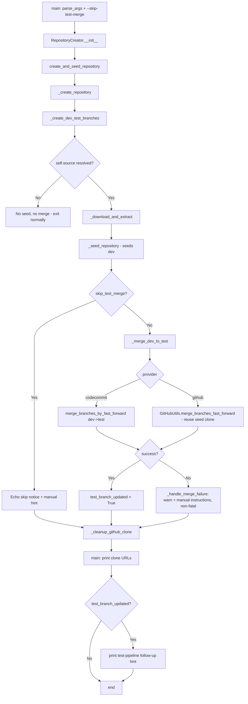

# Design Document: create_repo Auto-Merge dev to test

## Overview

This design updates `cli/create_repo.py` so that, after a repository is created and its `dev` branch is seeded, the seeded code is automatically merged from `dev` into `test`. The merge is the default behavior when the repository is seeded, is skippable via a new `--skip-test-merge` flag, and works for both the `codecommit` and `github` providers.

The change is localized to the tail of the existing seeding flow. The merge is inserted inside the current `if self.source:` block of `create_and_seed_repository()`, which means it inherits the existing "only when seeded" gate for free — if no `Source` is resolved (no `--source` and no application starter selected), the block is skipped and no merge occurs.

The merge is treated as a **non-fatal, best-effort** step: the repository and its seeded `dev` branch already exist and are valuable, so a merge failure warns and prints manual instructions rather than deleting the repository or exiting non-zero. On success, an informational follow-up hint guides the developer to create a test pipeline with `config.py`.

## Architecture



### Key Design Decisions

1. **Reuse the existing `if self.source:` gate.** The merge step is added inside the block that already guards seeding. This directly satisfies Requirement 2.3/2.4 (no merge when nothing was seeded) with no extra conditional and keeps the "seeded ⇒ merge" invariant obvious.

2. **Non-fatal failure semantics.** Unlike the seed/branch failure paths (which call `self.codecommit_client.delete_repository(...)` and `sys.exit(1)`), the merge failure path does neither. The repo + `dev` are intact and useful; a merge problem should not undo them. Merge helpers catch their own exceptions and route to `_handle_merge_failure()`. (Requirements 3.2, 3.3, 3.4, 3.5)

3. **Fast-forward only.** In the normal create-and-seed flow, `test` was branched from `main` and `dev` was branched from the same commit, then `dev` received the seed commit, so `test` is an ancestor of `dev` — a fast-forward is always valid. CodeCommit uses `merge_branches_by_fast_forward`; GitHub uses `git merge --ff-only`. Fast-forward creates no merge commit, so no merge-commit identity is required in the standard path. A non-fast-forwardable state (should not occur) surfaces as a handled, non-fatal failure. (Requirements 3.1, 4.1, 5.2)

4. **GitHub clone reuse.** GitHub seeding already clones the repo into a temp `git_dir` (via `_seed_repository_github` → `GitHubUtils.create_init_commit`). That clone already has the branches fetched and the commit author/email configured. The merge reuses it (`self._github_clone_dir`) instead of cloning again, and the clone is cleaned up centrally after the merge/skip decision. (Requirements 5.1, 5.3, 5.5)

5. **Explicit `targetBranch` for CodeCommit.** `merge_branches_by_fast_forward` is called with `sourceCommitSpecifier='dev'`, `destinationCommitSpecifier='test'`, and `targetBranch='test'` so the `test` branch reference is advanced. No local clone is needed for CodeCommit. (Requirements 4.1, 4.2)

6. **Hint printed last, gated on success.** `main()` prints the follow-up hint after the clone URLs, gated by `repo_creator.test_branch_updated`. This makes the next-step guidance the final thing the user sees, and guarantees the hint appears only on a successful merge (Requirements 6.1, 6.6). Skip/failure paths never set `test_branch_updated = True`.

7. **`subprocess` with `cwd=` (no `os.chdir`).** The new `GitHubUtils.merge_branches_fast_forward` uses `cwd=git_dir` on each `subprocess.run`, consistent with `create_init_commit`, and does not mutate the process working directory (avoiding the global `os.chdir` pattern used in `create_branch_structure`).

## Components and Interfaces

### Modified: `parse_args()` in `cli/create_repo.py`

Add an opt-out flag alongside the existing optional flags (`--no-browser`):

```python
parser.add_argument('--skip-test-merge',
                    action='store_true',   # boolean flag
                    default=False,          # merge happens by default
                    help='Do not merge the seeded dev branch into test. '
                         'By default, when a repository is seeded, dev is '
                         'merged into test so a test pipeline can be created '
                         'immediately. The merge only occurs when the repo is seeded.')
```

`argparse` exposes this as `args.skip_test_merge`.

### Modified: `RepositoryCreator.__init__()`

Add a keyword parameter and initialize new state:

```python
def __init__(self, repo_name, source=None, region=None, profile=None,
             prefix=None, provider=None, no_browser=False,
             skip_test_merge=False):
    ...
    self.skip_test_merge = skip_test_merge
    # Reused local clone from GitHub seeding (None for CodeCommit)
    self._github_clone_dir = None
    # Set True only after a successful dev->test merge; gates the follow-up hint
    self.test_branch_updated = False
```

New instance state:

| Attribute | Type | Purpose |
|-----------|------|---------|
| `self.skip_test_merge` | bool | Opt-out flag from `--skip-test-merge` |
| `self._github_clone_dir` | Optional[str] | Path to the clone created during GitHub seeding, reused by the GitHub merge |
| `self.test_branch_updated` | bool | True only after a successful merge; gates the follow-up hint |

### Modified: `main()` — construct with the flag and print the hint

Pass the new flag into the constructor:

```python
repo_creator = RepositoryCreator(
    args.repository_name, args.source,
    args.region, args.profile,
    args.prefix, args.provider,
    args.no_browser,
    skip_test_merge=args.skip_test_merge
)
```

After the existing clone-URL output, print the follow-up hint when the merge succeeded:

```python
    click.echo(Colorize.output_with_value("Clone URL (HTTPS):", clone_urls.get('https', '')))
    click.echo(Colorize.output_with_value("Clone URL (SSH):", clone_urls.get('ssh', '')))

    if repo_creator.test_branch_updated:
        print()
        for line in repo_creator.build_test_pipeline_hint():
            click.echo(line)

    print()
    click.echo(Colorize.divider("="))
    print()
```

### Modified: `create_and_seed_repository()`

Insert the merge step (and centralized clone cleanup) after seeding:

```python
def create_and_seed_repository(self):
    # Create repository
    self._create_repository()

    # Create branch structure
    self._create_dev_test_branches()

    if self.source:
        # Download and extract files
        temp_dir = self._download_and_extract()

        # Seed repository with initial commit (onto 'dev')
        self._seed_repository(temp_dir)

        # After seeding, merge dev -> test so a test pipeline can be created immediately
        try:
            if self.skip_test_merge:
                self._skip_test_merge_notice()
            else:
                self._merge_dev_to_test()
        finally:
            self._cleanup_github_clone()
```

The `try/finally` guarantees the reused GitHub clone is removed on every path (merge, skip, or unexpected error). For CodeCommit, `_cleanup_github_clone()` is a no-op because `self._github_clone_dir` remains `None`.

### Modified: `_seed_repository_github()` — retain the clone for reuse

The method currently creates `git_dir = tempfile.mkdtemp()` and never cleans it up. Store it on the instance so the merge can reuse it; cleanup moves to `_cleanup_github_clone()` (called from `create_and_seed_repository`):

```python
def _seed_repository_github(self, temp_dir):
    try:
        all_files = self._seed_collect_files(temp_dir)
        total_files = len(all_files)
        seed_branch = "dev"
        ...
        # Create a temporary directory for git operations and retain it for the merge step
        git_dir = tempfile.mkdtemp()
        self._github_clone_dir = git_dir

        GitHubUtils.create_init_commit(all_files, self.repo_name, seed_branch,
                                       self.get_init_commit_author(),
                                       self.get_init_commit_email(), git_dir)
        ...
    except Exception as e:
        ...
        sys.exit(1)
    finally:
        shutil.rmtree(temp_dir, ignore_errors=True)   # extracted files only; NOT git_dir
```

> Note: The `git_dir` clone already has `git config user.name/user.email` set to `get_init_commit_author()`/`get_init_commit_email()` (configured inside `create_init_commit`), which is exactly the identity the merge reuses. (Requirement 5.3)

### New: `_merge_dev_to_test()` — provider dispatcher

Mirrors the existing `_create_dev_test_branches()` / `_seed_repository()` dispatch pattern:

```python
def _merge_dev_to_test(self):
    """Merge the seeded 'dev' branch into 'test' (best-effort, non-fatal)."""
    if self.provider == 'codecommit':
        self._merge_dev_to_test_codecommit()
    elif self.provider == 'github':
        self._merge_dev_to_test_github()
```

### New: `_merge_dev_to_test_codecommit()`

```python
def _merge_dev_to_test_codecommit(self):
    try:
        click.echo(Colorize.output("Merging dev into test (fast-forward)"))
        Log.info("Merging dev into test on CodeCommit via fast-forward")

        self.codecommit_client.merge_branches_by_fast_forward(
            repositoryName=self.repo_name,
            sourceCommitSpecifier='dev',
            destinationCommitSpecifier='test',
            targetBranch='test'
        )

        self.test_branch_updated = True
        click.echo(Colorize.success("Successfully merged dev into test"))
        Log.info("Successfully merged dev into test")
    except Exception as e:
        self._handle_merge_failure(e)
```

### New: `_merge_dev_to_test_github()`

Reuses the seed clone; guards against a missing clone dir:

```python
def _merge_dev_to_test_github(self):
    try:
        click.echo(Colorize.output("Merging dev into test (fast-forward)"))
        Log.info("Merging dev into test on GitHub via fast-forward")

        if not self._github_clone_dir or not os.path.isdir(self._github_clone_dir):
            raise RuntimeError("Seed clone directory is unavailable for merge")

        GitHubUtils.merge_branches_fast_forward(
            self._github_clone_dir,
            source_branch='dev',
            dest_branch='test'
        )

        self.test_branch_updated = True
        click.echo(Colorize.success("Successfully merged dev into test"))
        Log.info("Successfully merged dev into test")
    except Exception as e:
        self._handle_merge_failure(e)
```

### New: `_handle_merge_failure()` — non-fatal handler

```python
def _handle_merge_failure(self, error):
    """Warn and print manual merge instructions. Never deletes the repo or exits."""
    self.test_branch_updated = False
    Log.warning(f"Could not merge dev into test: {str(error)}")
    click.echo(Colorize.warning(
        "Could not automatically merge dev into test. "
        "The repository and its dev branch are intact."))
    click.echo(Colorize.output("To merge dev into test manually:"))
    for line in self._build_manual_merge_instructions():
        click.echo(Colorize.output(f"    {line}"))
```

### New: `_skip_test_merge_notice()`

```python
def _skip_test_merge_notice(self):
    """Inform the user the merge was skipped and how to perform it later."""
    Log.info("Skipping dev->test merge due to --skip-test-merge flag")
    click.echo(Colorize.output("Skipping merge of dev into test (--skip-test-merge)."))
    click.echo(Colorize.output("To merge dev into test later:"))
    for line in self._build_manual_merge_instructions():
        click.echo(Colorize.output(f"    {line}"))
```

### New: `_build_manual_merge_instructions()`

Provider-aware manual steps (uses the HTTPS clone URL when available):

```python
def _build_manual_merge_instructions(self):
    clone_url = ''
    try:
        clone_url = self.get_clone_urls().get('https', '') or self.repo_name
    except Exception:
        clone_url = self.repo_name
    return [
        f"git clone {clone_url}",
        "git checkout test",
        "git merge dev",
        "git push origin test",
    ]
```

### New: `build_test_pipeline_hint()`

Builds the follow-up hint lines per Requirement 6. The command keeps `<prefix>` and `<project_id>` as literal placeholders; `test` is literal; `--profile <profile>` is appended only when a profile was provided to `create_repo.py`; the `repo_name` line uses the actual value.

```python
def build_test_pipeline_hint(self):
    """Return the informational follow-up hint lines (no prompting)."""
    command = "./cli/config.py pipeline <prefix> <project_id> test"
    if self.profile:
        command += f" --profile {self.profile}"
    return [
        Colorize.output_bold("Next step: create the test pipeline"),
        Colorize.output("Run:"),
        Colorize.output_with_value("   ", command),
        Colorize.output(f"Use {self.repo_name} when prompted for the Repository parameter."),
    ]
```

Example rendered output when `--profile acme` was supplied and `repo_name` is `acme-web-app`:

```
Next step: create the test pipeline
Run:
    ./cli/config.py pipeline <prefix> <project_id> test --profile acme
Use acme-web-app when prompted for the Repository parameter.
```

Without `--profile`:

```
    ./cli/config.py pipeline <prefix> <project_id> test
```

### New: `GitHubUtils.merge_branches_fast_forward()` in `cli/lib/gh_utils.py`

```python
@staticmethod
def merge_branches_fast_forward(git_dir: str, source_branch: str = 'dev',
                                dest_branch: str = 'test') -> None:
    """Fast-forward merge source_branch into dest_branch in an existing local clone and push.

    Reuses a clone created during seeding (git user identity already configured).
    Checks out the destination branch, performs a fast-forward-only merge of the
    source branch, and pushes the destination branch to origin.

    Args:
        git_dir (str): Path to the existing local clone to operate in.
        source_branch (str): Branch to merge from (default 'dev').
        dest_branch (str): Branch to merge into and push (default 'test').

    Raises:
        Exception: If any git command fails (including a non-fast-forwardable merge).
    """
    try:
        subprocess.run(["git", "checkout", dest_branch],
                       cwd=git_dir, check=True, capture_output=True)
        subprocess.run(["git", "merge", "--ff-only", source_branch],
                       cwd=git_dir, check=True, capture_output=True)
        subprocess.run(["git", "push", "origin", dest_branch],
                       cwd=git_dir, check=True, capture_output=True)
    except subprocess.CalledProcessError as e:
        raise Exception(
            f"Error in GitHub CLI command: {e.cmd}\n"
            f"Output: {e.stdout.decode() if e.stdout else ''}\n"
            f"Error: {e.stderr.decode() if e.stderr else ''}")
```

Branch availability in the reused clone: `gh repo clone` (a `git clone`) fetches all remote branches as remote-tracking refs, and seeding already checked out/committed local `dev`. `git checkout test` creates a local `test` tracking `origin/test`; `git merge --ff-only dev` fast-forwards `test` to the local `dev` tip; `git push origin test` publishes it.

### New: `_cleanup_github_clone()`

```python
def _cleanup_github_clone(self):
    """Remove the reused GitHub seed clone, if any (no-op for CodeCommit)."""
    if self._github_clone_dir:
        shutil.rmtree(self._github_clone_dir, ignore_errors=True)
        self._github_clone_dir = None
```

### Modified: `EPILOG` in `cli/create_repo.py`

Add a note and example documenting the default merge behavior and the opt-out flag:

```text
    # Create repository, seed it, and (by default) merge dev into test
    create_repo.py your-webapp

    # Create and seed a repository but DO NOT merge dev into test
    create_repo.py your-webapp --skip-test-merge

Notes:
    When a repository is seeded (via --source or a selected application starter),
    the seeded dev branch is merged into test by default so you can create a test
    pipeline immediately. Use --skip-test-merge to leave test unchanged. If no
    source/starter is selected, nothing is seeded and no merge is performed.
```

## Data Models

This feature introduces no persisted data structures. It adds CLI state and in-memory instance attributes only:

| Element | Location | Type | Default | Notes |
|---------|----------|------|---------|-------|
| `--skip-test-merge` | `parse_args()` | flag → bool | `False` | Opt-out; merge is default |
| `skip_test_merge` | `RepositoryCreator` | bool | `False` | Mirrors the flag |
| `_github_clone_dir` | `RepositoryCreator` | Optional[str] | `None` | Reused GitHub seed clone path |
| `test_branch_updated` | `RepositoryCreator` | bool | `False` | Gates the follow-up hint |

Branch/merge topology (both providers) in the normal flow:

```
main  (README)
  └── test  (README)            ← fast-forwarded to dev after seeding
        └── dev  (README + seed) ← seeded from Source
```

## Correctness Properties

*A property is a characteristic or behavior that should hold true across all valid executions of a system.*

### Property 1: Merge is attempted exactly when seeded and not opted out

*For any* combination of `source` (resolved or not) and `skip_test_merge` (true/false), the dev→test merge SHALL be attempted if and only if a `Source` is resolved AND `skip_test_merge` is False. When no `Source` is resolved, no merge SHALL be attempted regardless of the flag.

**Validates: Requirements 1.1, 2.2, 2.3, 2.4**

### Property 2: Follow-up hint command construction

*For any* `repo_name` and `profile` value, `build_test_pipeline_hint()` SHALL produce a command line containing the literal substring `./cli/config.py pipeline <prefix> <project_id> test` with the `<prefix>` and `<project_id>` placeholders preserved verbatim; SHALL append ` --profile <profile>` using the actual profile value if and only if `profile` is truthy; and SHALL include a separate line containing the actual `repo_name` value alongside the "Repository parameter" instruction.

**Validates: Requirements 6.2, 6.3, 6.4, 6.5**

### Property 3: Merge failure is non-fatal and leaves the hint suppressed

*For any* error raised by a provider merge operation, `_handle_merge_failure()` SHALL NOT raise `SystemExit`, SHALL NOT invoke repository deletion, and SHALL leave `test_branch_updated` False so that no follow-up hint is printed.

**Validates: Requirements 3.2, 3.3, 3.4, 6.6**

### Property 4: Successful merge enables the hint; skip/failure disables it

*For any* execution, `test_branch_updated` SHALL be True if and only if a provider merge operation completed without raising. When the merge is skipped via `--skip-test-merge` or fails, `test_branch_updated` SHALL remain False.

**Validates: Requirements 6.1, 6.6**

### Property 5: GitHub merge reuses the seed clone and cleans it up

*For any* successful or failed GitHub merge, the operation SHALL use `self._github_clone_dir` (no additional clone is created), and after the merge/skip decision the clone directory SHALL be removed and `self._github_clone_dir` reset to `None`.

**Validates: Requirements 5.1, 5.5**

## Error Handling

| Scenario | Behavior | Repo deleted? | Exit code |
|----------|----------|---------------|-----------|
| No `Source` resolved | Skip seeding and merge; finish normally | No | 0 |
| `--skip-test-merge` set | Print skip notice + manual instructions; no merge | No | 0 |
| CodeCommit `merge_branches_by_fast_forward` raises | `_handle_merge_failure`: warn + manual instructions | No | 0 |
| GitHub `git checkout/merge/push` non-zero | `_handle_merge_failure`: warn + manual instructions | No | 0 |
| GitHub seed clone dir missing/invalid | Raise → `_handle_merge_failure`: warn + manual instructions | No | 0 |
| Merge succeeds | Set `test_branch_updated`; print success; hint in `main()` | No | 0 |

Contrast with existing behavior: seeding/branch failures still delete the repository and `sys.exit(1)`. The merge step deliberately does **not** adopt that behavior because the repository and `dev` branch are already created and useful. Merge failures are recorded via `Log.warning` and surfaced via `Colorize.warning`, consistent with existing output styling.

Manual instructions shown on skip/failure:

```
git clone <https-clone-url>
git checkout test
git merge dev
git push origin test
```

## Testing Strategy

### Property-Based Testing

**Library**: [Hypothesis](https://hypothesis.readthedocs.io/) (already used in this repo; see `tests/` and `.hypothesis/`).
**Configuration**: Minimum 100 iterations per property test.
**Tag format** on each property test:

```python
# Feature: create-repo-auto-merge-test-branch, Property N: <property_text>
```

To keep the pure logic testable, the following are implemented as side-effect-free helpers that property tests exercise directly:
- `build_test_pipeline_hint()` — string construction (Property 2)
- A small pure predicate for the gating decision (e.g. `should_merge_test(source, skip_test_merge)` returning `bool(source) and not skip_test_merge`) used by `create_and_seed_repository()` (Property 1)

| Property | Function Under Test | Generator Strategy |
|----------|---------------------|--------------------|
| 1: Merge gating | `should_merge_test()` | `source` ∈ {None, "", random S3/GitHub URIs}; `skip_test_merge` ∈ {True, False} |
| 2: Hint construction | `build_test_pipeline_hint()` | Random `repo_name` (owner/repo and plain), `profile` ∈ {None, random profile names} |
| 3: Non-fatal failure | `_handle_merge_failure()` | Random exception types/messages; assert no `SystemExit`, `delete_repository` not called (mock), `test_branch_updated` False |
| 4: Hint gating | merge outcome → `test_branch_updated` | Parametrized success/skip/failure outcomes |
| 5: Clone reuse/cleanup | GitHub merge + `_cleanup_github_clone()` | Temp dirs; assert reuse of `_github_clone_dir` and removal afterward |

### Unit Tests (Example-Based, mocked boto3/subprocess)

| Category | Tests |
|----------|-------|
| Flag parsing | `--skip-test-merge` defaults False; present ⇒ True |
| CodeCommit merge | `merge_branches_by_fast_forward` called with `sourceCommitSpecifier='dev'`, `destinationCommitSpecifier='test'`, `targetBranch='test'`, `repositoryName=repo_name`; sets `test_branch_updated` |
| CodeCommit merge failure | boto3 raises ⇒ no `delete_repository`, no `SystemExit`, warning + manual instructions printed |
| GitHub merge | `merge_branches_fast_forward` issues `checkout test`, `merge --ff-only dev`, `push origin test` with `cwd=git_dir`; reuses `_github_clone_dir` |
| GitHub merge failure | `CalledProcessError` ⇒ handled non-fatally; clone still cleaned up |
| Skip path | `--skip-test-merge` ⇒ no merge call, skip notice printed, GitHub clone cleaned up, `test_branch_updated` False |
| No-source path | no starter/source ⇒ neither seeding nor merge invoked |
| Hint output | printed only when `test_branch_updated` True; contains placeholders, conditional `--profile`, and `repo_name` |
| EPILOG/help | help text documents `--skip-test-merge` and default merge behavior |

### Integration-Style Tests (mocked provider boundaries)

| Test | Description |
|------|-------------|
| CodeCommit end-to-end | `create_and_seed_repository()` with a fake source drives create → branches → seed → merge → hint flag |
| GitHub end-to-end | Same flow verifying seed clone is created once, reused for merge, then removed |
| Merge failure does not abort run | `main()` still prints clone URLs and exits 0 when merge fails |

### Test File Organization

```
tests/
├── test_create_repo_merge.py        # Properties 1-5, CodeCommit/GitHub/skip/no-source unit tests
└── test_gh_utils_merge.py           # GitHubUtils.merge_branches_fast_forward command sequence
```
