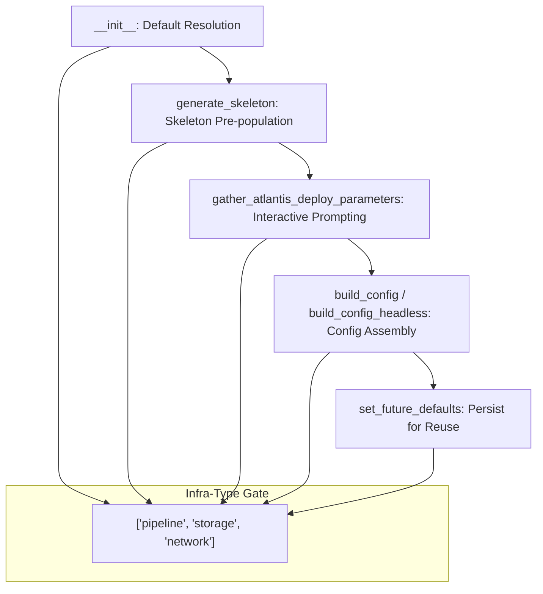

# Design Document: Network Role ARN Support

## Overview

This feature extends `role_arn` support to the `network` infrastructure type in the Atlantis SAM Config CLI, making it behave identically to `pipeline` and `storage`. The change is mechanical: every condition that gates role_arn behavior on `['pipeline', 'storage']` gains `'network'`, and a new `NetworkServiceRoleArn` defaults key is introduced for persisting and resolving network-specific role ARN values.

The implementation touches seven locations in `cli/config.py`, all following the same pattern of adding `'network'` to existing infra-type checks. The `service-role` infra type remains explicitly excluded from role_arn behavior.

## Architecture

The existing role_arn handling is distributed across several methods in `ConfigManager`:



Each method uses an infra-type membership check to decide whether role_arn logic applies. The change adds `'network'` to each of these gates.

### Design Decisions

1. **Mechanical addition over refactoring**: Rather than extracting the infra-type list to a constant, we add `'network'` to each existing inline list. This keeps the change minimal and reduces risk. A follow-up refactoring could extract `ROLE_ARN_INFRA_TYPES = ['pipeline', 'storage', 'network']` as a class constant.

2. **Separate defaults key (`NetworkServiceRoleArn`)**: Follows the established naming pattern (`StorageServiceRoleArn`, `PipelineServiceRoleArn`). Each infra type stores its role ARN independently so different networks/pipelines/storage stacks can use different roles.

3. **No changes to validation logic**: The same `validate_role_arn()` function is reused for network. No new validation rules are needed.

## Components and Interfaces

### Modified Methods in `ConfigManager`

| Method | Change | Purpose |
|--------|--------|---------|
| `__init__` (~line 127-131) | Add `elif self.infra_type == 'network' and 'NetworkServiceRoleArn' in self.defaults['atlantis']` | Resolve default role_arn from NetworkServiceRoleArn key |
| `gather_atlantis_deploy_parameters()` (~line 465) | Add `'network'` to `['pipeline', 'storage']` check | Enable interactive role_arn prompting for network |
| `set_future_defaults()` (~line 1028-1034) | Add `elif self.infra_type == 'network': default_param = 'NetworkServiceRoleArn'` | Save role_arn under the correct key |
| `generate_skeleton()` (~line 1227) | Add `'network'` to `['pipeline', 'storage']` check | Include role_arn in skeleton output |
| Skeleton default resolution (~line 1197-1203) | Add `elif self.infra_type == 'network' and atlantis_defaults.get('NetworkServiceRoleArn')` | Pre-populate role_arn from defaults |
| `build_config()` (~line 1943) | Add `'network'` to `['pipeline', 'storage']` check | Include role_arn in atlantis default deploy params |
| `build_config_headless()` (~line 2060) | Add `'network'` to `['pipeline', 'storage']` check | Include role_arn in headless config output |

### Interface Contract

The public interface remains unchanged. `ConfigManager` accepts `infra_type='network'` as the first positional argument (already supported). The behavioral change is that network now participates in role_arn flows that were previously limited to pipeline and storage.

## Data Models

### Defaults File Structure (JSON)

```json
{
  "atlantis": {
    "s3_bucket": "my-deploy-bucket",
    "region": "us-east-1",
    "role_arn": "arn:aws:iam::123456789012:role/GenericRole",
    "StorageServiceRoleArn": "arn:aws:iam::123456789012:role/StorageRole",
    "PipelineServiceRoleArn": "arn:aws:iam::123456789012:role/PipelineRole",
    "NetworkServiceRoleArn": "arn:aws:iam::123456789012:role/NetworkRole"
  }
}
```

The new `NetworkServiceRoleArn` key sits alongside existing type-specific keys.

### Infra-Type to Defaults Key Mapping

| Infra Type | Defaults Key | Behavior |
|------------|-------------|----------|
| `pipeline` | `PipelineServiceRoleArn` | Prompt, resolve, persist, propagate |
| `storage` | `StorageServiceRoleArn` | Prompt, resolve, persist, propagate |
| `network` | `NetworkServiceRoleArn` | Prompt, resolve, persist, propagate (NEW) |
| `service-role` | N/A | No role_arn handling |

### Config Output Structure

When `infra_type` is `network` and a role_arn is provided:

```json
{
  "atlantis": {
    "deploy": {
      "parameters": {
        "template_file": "s3://bucket/template.yml",
        "s3_bucket": "deploy-bucket",
        "region": "us-east-1",
        "capabilities": "CAPABILITY_NAMED_IAM",
        "confirm_changeset": true,
        "role_arn": "arn:aws:iam::123456789012:role/NetworkRole"
      }
    }
  },
  "deployments": {
    "dev": {
      "deploy": {
        "parameters": {
          "template_file": "s3://bucket/template.yml",
          "s3_bucket": "deploy-bucket",
          "region": "us-east-1",
          "capabilities": "CAPABILITY_NAMED_IAM",
          "confirm_changeset": true,
          "role_arn": "arn:aws:iam::123456789012:role/NetworkRole",
          "stack_name": "acme-myapp-dev-network",
          "s3_prefix": "acme-myapp-dev-network",
          "parameter_overrides": {},
          "tags": []
        }
      }
    }
  }
}
```

## Correctness Properties

*A property is a characteristic or behavior that should hold true across all valid executions of a system — essentially, a formal statement about what the system should do. Properties serve as the bridge between human-readable specifications and machine-verifiable correctness guarantees.*

### Property 1: Role ARN Propagation for Supported Infra Types

*For any* valid role ARN and *for any* infra type in `{pipeline, storage, network}`, when `build_config_headless()` is called with that role ARN, it SHALL appear in both `config['atlantis']['deploy']['parameters']['role_arn']` and in every `config['deployments'][stage]['deploy']['parameters']['role_arn']` with the same value.

**Validates: Requirements 2.1, 2.2, 2.3, 6.3**

### Property 2: Service-Role Exclusion (Preservation)

*For any* configuration input where `infra_type` is `service-role`, `role_arn` SHALL NOT appear in `config['atlantis']['deploy']['parameters']` nor in any `config['deployments'][stage]['deploy']['parameters']`, regardless of whether a role_arn value is supplied in the input.

**Validates: Requirements 6.4**

### Property 3: NetworkServiceRoleArn Default Resolution

*For any* valid role ARN value stored under `defaults['atlantis']['NetworkServiceRoleArn']`, when a `ConfigManager` is initialized with `infra_type='network'` and no explicit `role_arn` in defaults, the system SHALL resolve `defaults['atlantis']['role_arn']` to the `NetworkServiceRoleArn` value.

**Validates: Requirements 4.1, 3.2**

### Property 4: Infra-Type Key Isolation

*For any* three distinct valid role ARN values assigned to `StorageServiceRoleArn`, `PipelineServiceRoleArn`, and `NetworkServiceRoleArn` respectively, each infra type SHALL resolve only its own key and SHALL NOT cross-contaminate with another type's value.

**Validates: Requirements 4.3**

### Property 5: Future Defaults Persistence Under Correct Key

*For any* valid role ARN value, when `set_future_defaults()` is called for a network deployment and the user confirms saving, the value SHALL be persisted under the `NetworkServiceRoleArn` key in the defaults data (not under `role_arn`, `StorageServiceRoleArn`, or `PipelineServiceRoleArn`).

**Validates: Requirements 5.2**

## Error Handling

No new error conditions are introduced. The existing error handling applies uniformly:

| Scenario | Handling | Existing Behavior (unchanged) |
|----------|----------|-------------------------------|
| Invalid role_arn format | `validate_role_arn()` returns False, user re-prompted | Same as pipeline/storage |
| User cancels (Ctrl+C) | `KeyboardInterrupt` caught, clean exit | Same across all types |
| Missing defaults file | Falls through to generic `role_arn` or empty string | Existing fallback logic |
| Empty role_arn after prompt | Validation rejects empty string, re-prompts | Same as pipeline/storage |

## Testing Strategy

### Property-Based Tests (Hypothesis)

The feature is well-suited for property-based testing because:
- The core behavior (role_arn propagation) is a pure data transformation with clear input/output
- The input space (valid ARNs × infra types × config variations) is large
- Universal properties hold across all valid inputs

**Library**: `hypothesis` (already in use, see existing `.hypothesis/` directory)

**Configuration**: Minimum 100 examples per property test (`@settings(max_examples=100)`)

**Tag format**: Each test is annotated with a comment referencing its design property:
`# Feature: network-role-arn-support, Property N: <property text>`

| Property | Test Description | Infra Types | Key Assertion |
|----------|-----------------|-------------|---------------|
| 1 | role_arn propagates to atlantis + all deployments | pipeline, storage, network | role_arn present and matches input |
| 2 | role_arn absent for service-role | service-role | role_arn not in any params dict |
| 3 | NetworkServiceRoleArn resolves during init | network | defaults['atlantis']['role_arn'] == NetworkServiceRoleArn value |
| 4 | Each type resolves only its own key | all three | no cross-contamination |
| 5 | set_future_defaults saves under NetworkServiceRoleArn | network | key name is correct |

### Unit Tests (Example-Based)

Unit tests complement property tests for specific scenarios and interactive flows:

- `test_gather_atlantis_deploy_parameters_prompts_role_arn_for_network`: Mock `click.prompt`, verify role_arn prompt fires for network
- `test_network_falls_back_to_generic_role_arn`: No NetworkServiceRoleArn in defaults, generic role_arn used
- `test_network_samconfig_role_arn_override`: Existing samconfig role_arn used when no NetworkServiceRoleArn
- `test_set_future_defaults_declined_leaves_file_unchanged`: User says no, defaults unchanged
- `test_validation_rejects_invalid_arns_for_network`: Edge cases like empty string, malformed ARN

### Test File

Update existing `tests/test_config_role_arn.py`:
- Change `preservation_infra_type` strategy from `st.sampled_from(['network', 'service-role'])` to `st.just('service-role')` (network is no longer excluded)
- Add `'network'` to `bug_condition_infra_type` strategy: `st.sampled_from(['pipeline', 'storage', 'network'])`
- Add new test classes for Properties 3, 4, and 5
- Add unit test methods for interactive flows
