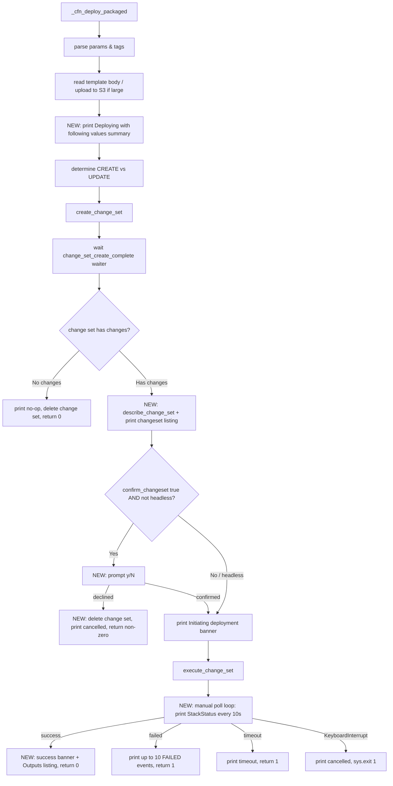

# Design: Add Formatting and Confirmation to CloudFormation Deploy

## Overview

All changes are confined to the CloudFormation branch of `cli/deploy.py` — the
`_cfn_deploy_packaged()` method and a set of new private helper methods on `TemplateDeployer`. The
SAM branch (`_run_sam_deploy`) and the branch-dispatch logic in `deploy_with_temp_template()` are not
touched.

Today `_cfn_deploy_packaged()` performs: parse params/tags → read template body (inline or S3
upload) → determine CREATE vs UPDATE → `create_change_set` → wait (silent waiter) → `execute_change_set`
→ wait (silent waiter) → success/failure. This design inserts formatting, a changeset listing, a
confirmation gate, interval progress output, a success banner, and an Outputs listing at the
appropriate points, and switches the execution wait from a silent boto3 waiter to a manual polling
loop modeled on `delete.py`.

The output style is delivered through the existing `Colorize` API (`cli/lib/tools.py`), which is
already used by `delete.py` and `config.py`. `deploy.py` does not currently import it, so this is a
new (additive) dependency for the script.

_Requirements traceability appears in parentheses, e.g. (R1.2)._

## Current vs. target flow



Steps D, J, K/L/M, P, Q are new; the rest already exist.

## Imports

Add to `deploy.py`'s import block (near the existing `from lib.*` imports):

```python
import click
from lib.tools import Colorize
```

`time` is already imported locally inside `_cfn_deploy_packaged`; it will be needed by the polling
loop and can remain a local import or be hoisted — no functional difference.

## Formatting helpers

To keep `_cfn_deploy_packaged()` readable and match the SAM look (yellow headings with `=` dividers),
add small private helpers on `TemplateDeployer`.

### `_print_section_heading(heading: str) -> None` (R2.2)

Prints a heading and an `=` divider beneath it, both yellow. Uses `Colorize.divider('=', ...)` styled
with the warning/yellow color and `Colorize.output_bold(heading, fg=Colorize.WARNING)` (yellow).

```python
def _print_section_heading(self, heading: str) -> None:
    click.echo(Colorize.output_bold(heading, fg=Colorize.WARNING))
    click.echo(Colorize.divider('=', fg=Colorize.WARNING))
```

> Note: `Colorize.WARNING` resolves to yellow via `tools_colors.py`. `Colorize.divider` and
> `output_bold` already accept an `fg` keyword.

### `_print_deploy_values_summary(deploy_params, cfn_parameters, cfn_tags, s3_bucket_display) -> None` (R1)

Prints the "Deploying with following values" section. Each line uses
`Colorize.output_with_value(label, value)` (green label, yellow value) (R1.6).

Fields, in order:

| Label | Source | Condition |
|-------|--------|-----------|
| `Stack name` | `deploy_params['stack_name']` | always (R1.2) |
| `Region` | `deploy_params['region']` | always |
| `Confirm changeset` | `deploy_params['confirm_changeset']` | always |
| `Capabilities` | joined `capabilities` list | always |
| `Role ARN` | `deploy_params['role_arn']` | only when non-empty (R1.3) |
| `Deployment s3 bucket` | upload bucket | only when template uploaded to S3 (R1.4) |
| `Parameter overrides` | `cfn_parameters` rendered as `{Key: Value, ...}` | always |
| `Tags` | `cfn_tags` rendered as `{Key: Value, ...}` | always |

`Disable rollback` and `Signing Profiles` are intentionally omitted (R1.5). Parameter overrides/tags
are rendered compactly (a JSON-ish dict string) to resemble the SAM table without dumping raw API
structures.

### `_print_changeset_summary(changes: list) -> None` (R3)

Given the `Changes` list from `describe_change_set`, prints a heading (`Changeset`) and one line per
change. For each `change['ResourceChange']`:

- `Action` (`Add` / `Modify` / `Remove`) from `ResourceChange['Action']`
- `LogicalResourceId`
- `ResourceType`
- `Replacement` — only when present
- `PhysicalResourceId` — only when present

Formatted as aligned columns loosely resembling SAM's changeset table (R3.3); no raw JSON (R3.4).

### `_print_success_banner() -> None` and `_print_stack_outputs(outputs: list) -> None` (R7)

- Success banner: a green banner consistent with other scripts. Uses `Colorize.success(...)` for a
  clear message; optionally `Colorize.box_output([...])` for a boxed green banner. (Chosen style noted
  in tasks.)
- Outputs: WHEN the stack has Outputs, print an `Outputs` heading and one
  `Colorize.output_with_value(OutputKey, OutputValue)` line per output (including `Description` when
  present). WHEN there are no Outputs, print nothing (R7.3).

## Wait / progress loop

### `_wait_for_stack_operation(cfn_client, stack_name, change_set_type) -> bool` (R6)

Replaces the silent `stack_create_complete`/`stack_update_complete` waiter with a manual polling loop
modeled on `delete.py`'s `delete_stack()`:

```python
def _wait_for_stack_operation(self, cfn_client, stack_name, change_set_type) -> bool:
    import time
    max_attempts = 180      # 30 minutes at 10s (R6.3)
    attempt = 0
    success_statuses = {'CREATE_COMPLETE', 'UPDATE_COMPLETE'}
    failure_statuses = {
        'CREATE_FAILED', 'ROLLBACK_COMPLETE', 'ROLLBACK_FAILED',
        'UPDATE_FAILED', 'UPDATE_ROLLBACK_COMPLETE', 'UPDATE_ROLLBACK_FAILED',
    }
    try:
        while attempt < max_attempts:
            resp = cfn_client.describe_stacks(StackName=stack_name)
            status = resp['Stacks'][0]['StackStatus']
            if status in success_statuses:
                return True
            if status in failure_statuses:
                ConsoleAndLog.error(f"Stack operation failed with status: {status}")
                return False
            click.echo(Colorize.output(f"Stack update in progress... Status: {status}",
                                       fg=Colorize.SUCCESS))   # green (R6.2)
            time.sleep(10)
            attempt += 1
        ConsoleAndLog.error("Stack operation timed out after 30 minutes")   # (R6.4)
        return False
    except KeyboardInterrupt:
        click.echo(Colorize.error("\nOperation cancelled by user"))
        Log.info("Operation cancelled by user")
        sys.exit(1)     # (R6.5)
```

Notes:
- Green status output via `Colorize.output(..., fg=Colorize.SUCCESS)` (R6.2).
- Returns `True` on success, `False` on failure/timeout; the caller maps `False` to the existing
  failure path (print up to 10 FAILED events, return 1).
- The change set **creation** wait keeps the existing `change_set_create_complete` waiter; only a
  brief "Creating change set..." line is printed for that phase (R6.6).

## Changes to `_cfn_deploy_packaged()`

The method keeps its current structure; the following are inserted/changed:

1. **After** determining `template_source` (inline vs. S3 upload), capture whether an S3 upload
   happened and the bucket, then call `_print_deploy_values_summary(...)` before creating the change
   set (R1.1). The summary is printed regardless of CREATE/UPDATE.
2. **After** the `change_set_create_complete` waiter succeeds, call `describe_change_set` to obtain
   `Changes` and `Status`:
   - The existing empty-changeset handling stays (the waiter raises on the "didn't contain changes"
     reason → print no-op, delete change set, return 0) (R5).
   - On success with changes, call `_print_changeset_summary(changes)` (R3.1).
3. **Confirmation gate** (R4): compute
   `needs_confirm = bool(deploy_params.get('confirm_changeset', True)) and not self.override_confirm_changeset`.
   - IF `needs_confirm` → prompt `click.confirm(...)` styled via `Colorize`. On decline: delete the
     change set, print a cancellation message, `return 1` (non-zero) (R4.1, R4.3). The non-zero return
     causes `main()` to skip git commit/push and termination protection (R4.4).
   - ELSE → proceed without prompting (R4.2).
4. Print the `Initiating deployment` heading (yellow) before `execute_change_set` (parity with SAM /
   R14 answer).
5. Replace the silent stack waiter with `_wait_for_stack_operation(...)`:
   - `True` → print success banner (R7.1); read `describe_stacks(...)['Stacks'][0].get('Outputs', [])`
     and call `_print_stack_outputs(...)` when non-empty (R7.2/7.3); return 0.
   - `False` → keep the existing "print up to 10 FAILED events" block, recolored with
     `Colorize.error` (R8.1); return 1.

### Confirmation gate detail

```python
change_set_type_is_review = ...  # unchanged
# after listing changes:
needs_confirm = bool(deploy_params.get('confirm_changeset', True)) \
    and not self.override_confirm_changeset
if needs_confirm:
    if not click.confirm(Colorize.question("Deploy this change set?"), default=False):
        ConsoleAndLog.info("Deployment cancelled by user.")
        try:
            cfn_client.delete_change_set(StackName=stack_name, ChangeSetName=change_set_name)
        except Exception:
            pass
        return 1
```

`click.confirm(..., default=False)` gives the `[y/N]` behavior (R4.1).

## Error handling

- All new API calls (`describe_change_set` for listing, `describe_stacks` for Outputs) are wrapped so
  that a formatting/read failure does not crash a deployment that otherwise succeeded. A failure to
  fetch/print the changeset listing or Outputs is logged as a warning and does not change the exit
  code.
- The confirmation-decline and timeout paths delete/leave the change set as described and return
  non-zero without raising.
- `KeyboardInterrupt` during the poll loop exits with status 1 (matches `delete.py`).

## Logging

`ConsoleAndLog`/`Log` usage is preserved for log-file continuity; colorized `click.echo` output is
additive (R2.3). Where a line is both user-facing progress and log-worthy, keep the existing
`ConsoleAndLog` call and add the colorized console line (or use `ConsoleAndLog` for the log and
`click.echo(Colorize...)` for the styled console line, avoiding duplicate console prints).

## Testing strategy

Existing tests live in `tests/` (e.g. `tests/test_deploy_s3_include_flow.py`,
`tests/test_deploy_headless.py`) and mock the CloudFormation client. New/updated unit tests will:

1. **Values summary** — assert the summary is printed with the expected fields and that `Role ARN` /
   `Deployment s3 bucket` lines appear only under their conditions (R1).
2. **Changeset listing** — given a mocked `describe_change_set` with representative `Changes`, assert
   each change's Action/LogicalId/Type is rendered (R3).
3. **Confirmation gate** — parametrize over `confirm_changeset` × `override_confirm_changeset`:
   - true + not headless → `click.confirm` invoked; decline → change set deleted and return code 1
     (R4.1, R4.3); accept → `execute_change_set` called.
   - false or headless → no prompt, `execute_change_set` called (R4.2).
4. **Empty changeset** — waiter raises "didn't contain changes" → return 0, no prompt, no listing (R5).
5. **Progress loop** — mock `describe_stacks` to yield `..._IN_PROGRESS` then `..._COMPLETE`; assert a
   green status line per in-progress poll and `True` result; mock a failure status → `False`;
   (timeout tested by capping `max_attempts` via a small monkeypatch or by asserting the loop bound).
6. **Success banner + Outputs** — on success with Outputs, assert banner + each Output printed; with
   no Outputs, assert no Outputs section (R7).
7. **SAM branch untouched** — existing SAM-branch tests continue to pass unchanged (R9).

Tests run under the `.ve` virtual environment (`pytest`). Test-only deps stay in
`cli/requirements-test.txt`.

## Versioning (R10)

`deploy.py` currently reads `VERSION = "v0.2.0/2026-08-06"`. Per the versioning rule and the user's
answer, since the embedded date equals the effective work date (2026-08-06), the version stays
`v0.2.0/2026-08-06`. If implementation lands on a later date, bump MINOR to `v0.3.0/<date>` (this
feature adds backward-compatible behavior). No `cli/lib/` component is modified, so `tools.py` /
`tools_colors.py` versions are unchanged.

`CHANGELOG.md` gets a new entry under `v0.0.19 (unreleased)` → **Changed** referencing this spec, at
task-list completion.
