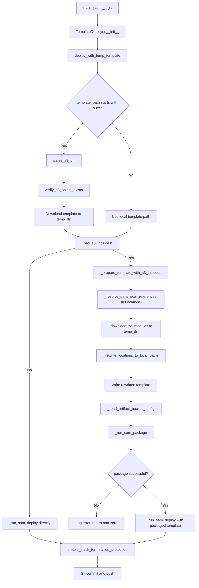

# Design Document: Pre-resolve AWS::Include S3 Locations Before SAM Deploy

**Spec Version:** 0-0-19  
**Feature:** preresolve-aws-include-s3-locations  
**GitHub Issue:** [#4](https://github.com/63Klabs/atlantis-sam-config-scripts/issues/4)  
**Status:** Design  
**Created:** 2026-08-05

## Overview

This design modifies `cli/deploy.py` to support CloudFormation templates that use `Fn::Transform: AWS::Include` with S3 `Location` URLs. The SAM CLI's `sam deploy` command cannot resolve S3-based includes because it passes templates directly to CloudFormation without processing `AWS::Include` transforms. 

The solution detects S3 includes in downloaded templates, downloads each referenced module to a local temp file, rewrites `Location` values to relative paths, runs `sam package` to natively resolve the includes and upload artifacts, then passes the packaged output to `sam deploy`. This approach leverages SAM CLI's existing `AWS::Include` resolution mechanism in the `sam package` command while maintaining backward compatibility with templates that don't use S3 includes.

## Architecture



### Key Design Decisions

1. **Use `sam package` for include resolution.** SAM CLI's `sam package` command has native support for resolving `AWS::Include` transforms via `_export_global_artifacts_pass()` in `samcli/lib/package/artifact_exporter.py`. By downloading S3 modules to local temp files and rewriting `Location` to relative paths, we delegate all YAML parsing, tag handling, and recursive resolution to SAM CLI.

2. **Two-path flow: direct deploy vs. package-then-deploy.** Templates without S3 includes skip the package step entirely and use the existing direct `sam deploy` path. This maintains backward compatibility and avoids unnecessary overhead for the common case.

3. **Parameter substitution before module download.** `Location` values often reference CloudFormation parameters like `!Sub '${S3ModuleLocation}/modules/file.yml'`. These must be resolved to concrete S3 URLs before downloading. Parameter values come from `parameter_overrides` in the samconfig TOML.

4. **Artifact bucket from samconfig.** `sam package` requires an S3 bucket to upload resolved artifacts. Every samconfig TOML already has `s3_bucket` and `s3_prefix` under `atlantis.deploy.parameters` (or stage-specific overrides). We read these values using the existing `tomli` parser.

5. **All temp files in one directory.** The existing `TemporaryDirectory` context in `deploy_with_temp_template()` holds the downloaded template. We add downloaded modules, the rewritten template, and the packaged output to the same directory so cleanup is automatic when the context exits.

6. **Fail fast on missing artifact bucket.** If S3 includes are detected but `s3_bucket` is not configured in samconfig, fail with a clear error directing the user to run `config.py` to configure the artifact bucket.

## Components and Interfaces

### Modified: `TemplateDeployer` Class in `cli/deploy.py`

#### New Method: `_has_s3_includes(template_path: Path) -> bool`

Scans a YAML/JSON template file for `Fn::Transform: AWS::Include` entries with S3 `Location` URLs.

```python
def _has_s3_includes(self, template_path: Path) -> bool:
    """Check if template contains Fn::Transform: AWS::Include with S3 locations.
    
    Args:
        template_path: Path to the template file (YAML or JSON).
    
    Returns:
        True if any S3-based AWS::Include transforms are found, False otherwise.
    
    Example S3 URL patterns detected:
        - s3://bucket/key
        - https://s3.amazonaws.com/bucket/key
        - https://bucket.s3.region.amazonaws.com/key
    """
    import yaml
    import json
    
    try:
        with open(template_path, 'r') as f:
            content = f.read()
        
        # Try YAML first (most common), fall back to JSON
        try:
            template = yaml.safe_load(content)
        except yaml.YAMLError:
            template = json.loads(content)
        
        # Recursively search for Fn::Transform with AWS::Include
        def find_s3_includes(obj):
            if isinstance(obj, dict):
                # Check for Fn::Transform: AWS::Include pattern
                if 'Fn::Transform' in obj or 'Fn::transform' in obj:
                    transform = obj.get('Fn::Transform') or obj.get('Fn::transform')
                    if isinstance(transform, dict):
                        name = transform.get('Name', '')
                        location = transform.get('Parameters', {}).get('Location', '')
                        if name == 'AWS::Include' and self._is_s3_url(location):
                            return True
                
                # Recurse into dict values
                for value in obj.values():
                    if find_s3_includes(value):
                        return True
            
            elif isinstance(obj, list):
                # Recurse into list items
                for item in obj:
                    if find_s3_includes(item):
                        return True
            
            return False
        
        return find_s3_includes(template)
    
    except Exception as e:
        ConsoleAndLog.warning(f"Could not scan template for S3 includes: {str(e)}")
        return False  # Fail open - proceed with direct deploy
```

**Returns:** `True` if S3 includes found, `False` otherwise or on scan error.

**Error Handling:** Catches parse errors and returns `False` (fail open - proceed with direct deploy). Logs warning if scan fails.

#### New Method: `_is_s3_url(url: str) -> bool`

Helper to detect S3 URLs in various formats.

```python
def _is_s3_url(self, url: str) -> bool:
    """Check if a string is an S3 URL.
    
    Args:
        url: String to check.
    
    Returns:
        True if url matches S3 URL patterns, False otherwise.
    
    Recognized patterns:
        - s3://bucket/key
        - https://s3.amazonaws.com/bucket/key
        - https://bucket.s3.region.amazonaws.com/key
    """
    if not isinstance(url, str):
        return False
    
    url_lower = url.lower()
    return (url_lower.startswith('s3://') or
            url_lower.startswith('https://s3.amazonaws.com/') or
            '.s3.' in url_lower and url_lower.startswith('https://'))
```

#### New Method: `_prepare_template_with_s3_includes(template_path: Path, temp_dir: Path) -> Path`

Orchestrates the S3 include resolution process: resolve parameters, download modules, rewrite `Location` values.

```python
def _prepare_template_with_s3_includes(self, template_path: Path, temp_dir: Path) -> Path:
    """Prepare template with S3 includes for sam package.
    
    Downloads S3 modules to local temp files and rewrites Location values
    to relative paths so sam package can resolve them natively.
    
    Args:
        template_path: Path to the downloaded template.
        temp_dir: Temporary directory for modules and rewritten template.
    
    Returns:
        Path to the rewritten template ready for sam package.
    
    Raises:
        ValueError: When module download fails or Location parsing fails.
    """
    import yaml
    
    ConsoleAndLog.info("Template contains S3 includes - preparing for sam package")
    
    # Load template
    with open(template_path, 'r') as f:
        template = yaml.safe_load(f)
    
    # Load parameter overrides from samconfig
    parameter_overrides = self._read_parameter_overrides()
    
    # Find all S3 includes and download modules
    module_map = {}  # Maps original S3 URL -> local relative path
    
    def process_includes(obj, path=""):
        if isinstance(obj, dict):
            # Check for Fn::Transform: AWS::Include
            if 'Fn::Transform' in obj or 'Fn::transform' in obj:
                transform = obj.get('Fn::Transform') or obj.get('Fn::transform')
                if isinstance(transform, dict):
                    name = transform.get('Name', '')
                    location = transform.get('Parameters', {}).get('Location', '')
                    
                    if name == 'AWS::Include' and self._is_s3_url(location):
                        # Resolve parameters in Location
                        resolved_url = self._resolve_parameter_references(
                            location, parameter_overrides
                        )
                        
                        # Download module if not already downloaded
                        if resolved_url not in module_map:
                            local_path = self._download_s3_module(
                                resolved_url, temp_dir, len(module_map)
                            )
                            module_map[resolved_url] = local_path
                            ConsoleAndLog.info(f"Downloaded module: {resolved_url} -> {local_path}")
                        
                        # Rewrite Location to relative path
                        transform['Parameters']['Location'] = module_map[resolved_url]
            
            # Recurse into dict values
            for key, value in obj.items():
                process_includes(value, f"{path}.{key}")
        
        elif isinstance(obj, list):
            # Recurse into list items
            for i, item in enumerate(obj):
                process_includes(item, f"{path}[{i}]")
    
    process_includes(template)
    
    # Write rewritten template
    rewritten_path = temp_dir / "template-rewritten.yml"
    with open(rewritten_path, 'w') as f:
        yaml.dump(template, f, default_flow_style=False, sort_keys=False)
    
    ConsoleAndLog.info(f"Wrote rewritten template: {rewritten_path}")
    ConsoleAndLog.info(f"Downloaded {len(module_map)} S3 module(s)")
    
    return rewritten_path
```

#### New Method: `_resolve_parameter_references(location: str, parameter_overrides: dict) -> str`

Resolves CloudFormation parameter references in `Location` values to concrete S3 URLs.

```python
def _resolve_parameter_references(self, location: str, parameter_overrides: dict) -> str:
    """Resolve CloudFormation parameter references in Location string.
    
    Supports:
        - !Ref ParameterName (YAML tag - parsed as dict)
        - !Sub '${ParameterName}/path' (YAML tag - parsed as dict)
        - Fn::Sub: ['${Param1}/path', {Param1: value}] (explicit function)
        - Fn::Join: ['/', [!Ref Param, 'path']] (explicit function)
    
    Args:
        location: Location value from template (may be string or dict with tags).
        parameter_overrides: Dict of parameter names to values.
    
    Returns:
        Resolved S3 URL as a string.
    
    Raises:
        ValueError: When required parameter is missing or parsing fails.
    """
    # If location is already a plain string with no tags, return as-is
    if isinstance(location, str):
        return location
    
    # Handle YAML tags parsed as dicts
    if isinstance(location, dict):
        # Handle !Ref
        if 'Ref' in location:
            param_name = location['Ref']
            if param_name not in parameter_overrides:
                raise ValueError(f"Parameter {param_name} not found in overrides")
            return parameter_overrides[param_name]
        
        # Handle !Sub
        if 'Fn::Sub' in location or 'Sub' in location:
            sub_value = location.get('Fn::Sub') or location.get('Sub')
            
            # Simple case: !Sub '${Param}/path'
            if isinstance(sub_value, str):
                result = sub_value
                for param_name, param_value in parameter_overrides.items():
                    result = result.replace(f'${{{param_name}}}', param_value)
                return result
            
            # Complex case: !Sub ['${Param}/path', {Param: value}]
            if isinstance(sub_value, list) and len(sub_value) == 2:
                template_str = sub_value[0]
                overrides = sub_value[1]
                result = template_str
                for key, value in overrides.items():
                    result = result.replace(f'${{{key}}}', str(value))
                return result
        
        # Handle !Join
        if 'Fn::Join' in location or 'Join' in location:
            join_value = location.get('Fn::Join') or location.get('Join')
            if isinstance(join_value, list) and len(join_value) == 2:
                delimiter = join_value[0]
                parts = []
                for part in join_value[1]:
                    if isinstance(part, str):
                        parts.append(part)
                    elif isinstance(part, dict) and 'Ref' in part:
                        param_name = part['Ref']
                        if param_name not in parameter_overrides:
                            raise ValueError(f"Parameter {param_name} not found")
                        parts.append(parameter_overrides[param_name])
                    else:
                        # Recursively resolve nested functions
                        parts.append(self._resolve_parameter_references(part, parameter_overrides))
                return delimiter.join(parts)
    
    raise ValueError(f"Unsupported Location format: {location}")
```

**Supported patterns:**
- `!Ref ParameterName`
- `!Sub '${ParameterName}/path'`
- `Fn::Sub: ['${Param1}/path', {Param1: value}]`
- `Fn::Join: ['/', [!Ref Param, 'path']]`

**Error Handling:** Raises `ValueError` if required parameter is missing or format is unsupported.

#### New Method: `_read_parameter_overrides() -> dict`

Reads parameter overrides from the samconfig TOML file.

```python
def _read_parameter_overrides(self) -> dict:
    """Read parameter overrides from samconfig TOML.
    
    Returns:
        Dict of parameter names to values from the active stage.
    
    Raises:
        ValueError: When samconfig file cannot be read.
    """
    try:
        config_file = self.get_samconfig_file_path()
        with open(config_file, 'rb') as f:
            config = tomli.load(f)
        
        # Get parameters from active stage (or default)
        stage_params = config.get(self.stage_id, {}).get('deploy', {}).get('parameters', {})
        default_params = config.get('default', {}).get('deploy', {}).get('parameters', {})
        
        # Merge: stage overrides default
        parameters = {**default_params, **stage_params}
        
        # Extract parameter_overrides string and parse
        param_overrides_str = parameters.get('parameter_overrides', '')
        
        # Parse "Key1=Value1 Key2=Value2" format
        overrides = {}
        if param_overrides_str:
            for pair in param_overrides_str.split():
                if '=' in pair:
                    key, value = pair.split('=', 1)
                    overrides[key] = value
        
        return overrides
    
    except Exception as e:
        raise ValueError(f"Failed to read parameter overrides: {str(e)}")
```

**Returns:** Dict mapping parameter names to values.

**Error Handling:** Raises `ValueError` if samconfig cannot be parsed.

#### New Method: `_download_s3_module(s3_url: str, temp_dir: Path, index: int) -> str`

Downloads an S3 module file to a local temp file.

```python
def _download_s3_module(self, s3_url: str, temp_dir: Path, index: int) -> str:
    """Download S3 module to local temp file.
    
    Args:
        s3_url: S3 URL to download.
        temp_dir: Directory to store downloaded module.
        index: Unique index for naming the local file.
    
    Returns:
        Relative path to the downloaded module (e.g., "./module-0.yml").
    
    Raises:
        ValueError: When download fails (access denied, not found, network error).
    """
    bucket, key, version_id = self.parse_s3_url(s3_url)
    
    # Determine file extension from key
    ext = Path(key).suffix or '.yml'
    local_filename = f"module-{index}{ext}"
    local_path = temp_dir / local_filename
    
    # Use appropriate S3 client
    s3_client = self.s3_client_anonymous if self.is_bucket_public(bucket) else self.s3_client
    
    try:
        get_args = {'Bucket': bucket, 'Key': key}
        if version_id:
            get_args['VersionId'] = version_id
        
        response = s3_client.get_object(**get_args)
        with open(local_path, 'wb') as f:
            f.write(response['Body'].read())
        
        # Return relative path for Location rewriting
        return f"./{local_filename}"
    
    except ClientError as e:
        error_code = e.response['Error']['Code']
        if error_code == 'AccessDenied':
            raise ValueError(
                f"Access denied downloading module from {s3_url}. "
                f"Check bucket permissions or authentication."
            )
        elif error_code == '404' or error_code == 'NoSuchKey':
            raise ValueError(f"Module not found: {s3_url}")
        else:
            raise ValueError(f"Failed to download module from {s3_url}: {str(e)}")
```

**Returns:** Relative path string like `"./module-0.yml"` for use in rewritten `Location`.

**Error Handling:** Raises `ValueError` with actionable message on download failure.

#### New Method: `_read_artifact_bucket_config() -> tuple[str, str]`

Reads artifact bucket configuration from samconfig TOML.

```python
def _read_artifact_bucket_config(self) -> tuple[str, str]:
    """Read artifact bucket configuration from samconfig TOML.
    
    Returns:
        Tuple of (s3_bucket, s3_prefix) from atlantis.deploy.parameters
        or stage-specific override.
    
    Raises:
        ValueError: When s3_bucket is not configured.
    """
    try:
        config_file = self.get_samconfig_file_path()
        with open(config_file, 'rb') as f:
            config = tomli.load(f)
        
        # Try atlantis section first (shared config)
        atlantis_params = config.get('atlantis', {}).get('deploy', {}).get('parameters', {})
        
        # Try stage-specific override
        stage_params = config.get(self.stage_id, {}).get('deploy', {}).get('parameters', {})
        
        # Merge: stage overrides atlantis
        s3_bucket = stage_params.get('s3_bucket') or atlantis_params.get('s3_bucket')
        s3_prefix = stage_params.get('s3_prefix') or atlantis_params.get('s3_prefix', '')
        
        if not s3_bucket:
            raise ValueError(
                "s3_bucket not configured in samconfig. "
                "Templates with S3 includes require an artifact bucket. "
                "Run 'config.py' to configure s3_bucket."
            )
        
        return s3_bucket, s3_prefix
    
    except tomli.TOMLDecodeError as e:
        raise ValueError(f"Invalid samconfig TOML: {str(e)}")
    except FileNotFoundError:
        raise ValueError(f"Samconfig file not found: {self.get_samconfig_file_path()}")
```

**Returns:** `(s3_bucket, s3_prefix)` tuple.

**Error Handling:** Raises `ValueError` with actionable message if `s3_bucket` is missing.

#### New Method: `_run_sam_package(template_path: Path, output_path: Path, s3_bucket: str, s3_prefix: str) -> int`

Executes the `sam package` command to resolve includes and upload artifacts.

```python
def _run_sam_package(self, template_path: Path, output_path: Path, 
                     s3_bucket: str, s3_prefix: str) -> int:
    """Execute sam package to resolve includes and upload artifacts.
    
    Args:
        template_path: Path to the rewritten template (with local includes).
        output_path: Path to write the packaged output template.
        s3_bucket: S3 bucket for artifact uploads.
        s3_prefix: S3 prefix for artifact uploads.
    
    Returns:
        Exit code from sam package (0 for success, non-zero for failure).
    """
    sam_cmd = [
        "sam.cmd" if os.name == 'nt' else "sam",
        "package",
        "--template-file", str(template_path),
        "--output-template-file", str(output_path),
        "--s3-bucket", s3_bucket
    ]
    
    if s3_prefix:
        sam_cmd.extend(["--s3-prefix", s3_prefix])
    
    if self.profile:
        sam_cmd.extend(["--profile", self.profile])
    
    ConsoleAndLog.info(f"Executing: {' '.join(sam_cmd)}")
    
    result = subprocess.run(
        sam_cmd,
        cwd=template_path.parent,  # Run in temp directory
        check=False,
        stdout=None,
        stderr=None,
        shell=True if os.name == 'nt' else False,
        env={
            **os.environ,
            'FORCE_COLOR': '1',
            'TERM': 'xterm-256color' if os.name != 'nt' else os.environ.get('TERM', '')
        }
    )
    
    if result.returncode != 0:
        ConsoleAndLog.error(f"sam package failed with exit code {result.returncode}")
    else:
        ConsoleAndLog.info(f"sam package completed successfully")
        ConsoleAndLog.info(f"Packaged template written to: {output_path}")
    
    return result.returncode
```

**Returns:** Exit code from `sam package` subprocess.

**Error Handling:** Logs error on non-zero exit but doesn't raise - caller checks return code.

#### Modified Method: `deploy_with_temp_template(template_path: str) -> int`

Updated to detect S3 includes and route through the package step when needed.

```python
def deploy_with_temp_template(self, template_path: str) -> int:
    """Deploy template from either S3 or local file.
    
    If template contains S3 includes, downloads modules and runs sam package
    before deploying. Otherwise uses direct sam deploy.
    
    Args:
        template_path: Either S3 URL (s3://) or local file path
        
    Returns:
        int: Return code from sam deploy
    """
    try:
        # Ensure config file exists
        config_path = self.get_samconfig_file_path()
        if not config_path.exists():
            ConsoleAndLog.error(f"Config file not found: {config_path}")
            return 1

        if template_path.startswith('s3://'):
            # Handle S3 template
            bucket, key, version_id = self.parse_s3_url(template_path)
            
            # Verify template exists
            if not self.verify_s3_object_exists(bucket, key, version_id):
                return 1

            # Create temp directory for S3 download
            with tempfile.TemporaryDirectory() as temp_dir:
                temp_dir_path = Path(temp_dir)
                ConsoleAndLog.info(f"Created temporary directory: {temp_dir}")
                
                # Download main template
                temp_template_path = temp_dir_path / "template.yml"
                ConsoleAndLog.info(f"Downloading template from s3://{bucket}/{key}" +
                            (f"?versionId={version_id}" if version_id else ""))
                
                # Switch to anonymous client if the bucket is public
                s3_client = self.s3_client_anonymous if self.is_bucket_public(bucket) else self.s3_client

                try:
                    get_args = {'Bucket': bucket, 'Key': key}
                    if version_id:
                        get_args['VersionId'] = version_id

                    response = s3_client.get_object(**get_args)
                    with open(temp_template_path, 'wb') as f:
                        f.write(response['Body'].read())

                except botocore.exceptions.ClientError as e:
                    if e.response['Error']['Code'] == 'AccessDenied':
                        if self.is_bucket_public(bucket):
                            error_msg = f"Access denied when using anonymous access for bucket '{bucket}'. The bucket may not be public or may require authentication."
                        else:
                            error_msg = f"Access denied when using authenticated access for bucket '{bucket}'. Check your permissions or try using anonymous access."
                        ConsoleAndLog.error(error_msg)
                    else:
                        ConsoleAndLog.error(f"Failed to download template: {str(e)}")
                    return 1
                
                # Check for S3 includes
                if self._has_s3_includes(temp_template_path):
                    # Package path: prepare template and run sam package
                    ConsoleAndLog.info("S3 includes detected - using sam package + deploy flow")
                    
                    try:
                        # Prepare template with S3 includes
                        rewritten_template = self._prepare_template_with_s3_includes(
                            temp_template_path, temp_dir_path
                        )
                        
                        # Read artifact bucket config
                        s3_bucket, s3_prefix = self._read_artifact_bucket_config()
                        
                        # Run sam package
                        packaged_template = temp_dir_path / "template-packaged.yml"
                        package_result = self._run_sam_package(
                            rewritten_template, packaged_template, s3_bucket, s3_prefix
                        )
                        
                        if package_result != 0:
                            return package_result
                        
                        # Deploy the packaged template
                        return self._run_sam_deploy(packaged_template, config_path)
                    
                    except ValueError as e:
                        ConsoleAndLog.error(f"Failed to prepare template: {str(e)}")
                        return 1
                else:
                    # Direct deploy path (no S3 includes)
                    ConsoleAndLog.info("No S3 includes detected - using direct sam deploy")
                    return self._run_sam_deploy(temp_template_path, config_path)
        else:
            # Handle local template
            local_template_path = self.config_dir / template_path
            if not local_template_path.exists():
                ConsoleAndLog.error(f"Local template file not found: {local_template_path}")
                return 1
            
            ConsoleAndLog.info(f"Using local template: {local_template_path}")
            
            # Check for S3 includes in local template
            if self._has_s3_includes(local_template_path):
                # Create temp directory for package step
                with tempfile.TemporaryDirectory() as temp_dir:
                    temp_dir_path = Path(temp_dir)
                    ConsoleAndLog.info("S3 includes detected in local template - using sam package + deploy flow")
                    
                    try:
                        # Prepare template
                        rewritten_template = self._prepare_template_with_s3_includes(
                            local_template_path, temp_dir_path
                        )
                        
                        # Read artifact bucket config
                        s3_bucket, s3_prefix = self._read_artifact_bucket_config()
                        
                        # Run sam package
                        packaged_template = temp_dir_path / "template-packaged.yml"
                        package_result = self._run_sam_package(
                            rewritten_template, packaged_template, s3_bucket, s3_prefix
                        )
                        
                        if package_result != 0:
                            return package_result
                        
                        # Deploy the packaged template
                        return self._run_sam_deploy(packaged_template, config_path)
                    
                    except ValueError as e:
                        ConsoleAndLog.error(f"Failed to prepare template: {str(e)}")
                        return 1
            else:
                # Direct deploy (no S3 includes)
                return self._run_sam_deploy(local_template_path, config_path)

    except Exception as e:
        ConsoleAndLog.error(f"Deployment failed: {str(e)}")
        raise
```

### Modified: `cli/requirements.txt`

Add PyYAML for YAML parsing (used only in the S3 include detection and rewriting):

```txt
# YAML parsing for S3 include detection and resolution
PyYAML>=6.0
```

**Note:** PyYAML is only used in `deploy.py` for scanning and rewriting templates with S3 includes. The actual `AWS::Include` resolution is performed by SAM CLI's `sam package` command.

## Data Structures

### Module Map

Used internally by `_prepare_template_with_s3_includes()` to track downloaded modules:

```python
module_map: Dict[str, str] = {}
# Maps: resolved S3 URL -> relative local path
# Example: {
#     's3://bucket/namespace/modules/role.yml': './module-0.yml',
#     's3://bucket/namespace/modules/policy.yml': './module-1.yml'
# }
```

### Parameter Overrides

Parsed from samconfig TOML `parameter_overrides` string:

```python
parameter_overrides: Dict[str, str] = {}
# Maps: parameter name -> parameter value
# Example: {
#     'S3ModuleLocation': 's3://bucket/namespace/templates/v2/modules',
#     'S3ModuleNamespace': 'my-org',
#     'Environment': 'dev'
# }
```

## Error Handling

### Error Scenarios and Responses

| Scenario | Detection | Response |
|----------|-----------|----------|
| Template scan fails | `_has_s3_includes()` catches exception | Log warning, return `False` (fail open), proceed with direct `sam deploy` |
| Missing parameter reference | `_resolve_parameter_references()` cannot find parameter in overrides | Raise `ValueError`, abort deploy with return code `1` |
| Unsupported `Location` format | `_resolve_parameter_references()` reaches unhandled branch | Raise `ValueError` describing the unsupported format, abort deploy |
| Module download access denied | `_download_s3_module()` catches `AccessDenied` | Raise `ValueError` directing user to check permissions/authentication |
| Module not found | `_download_s3_module()` catches `404`/`NoSuchKey` | Raise `ValueError` naming the missing S3 URL |
| Artifact bucket not configured | `_read_artifact_bucket_config()` finds no `s3_bucket` | Raise `ValueError` directing user to run `config.py` |
| Invalid samconfig TOML | `_read_artifact_bucket_config()` catches `TOMLDecodeError` | Raise `ValueError` with parse error detail |
| `sam package` fails | `_run_sam_package()` returns non-zero exit code | Log error, return the non-zero exit code without attempting deploy |

### Fail-Open vs. Fail-Fast Strategy

- **Fail open** for template scanning (`_has_s3_includes`). A scan error should never block a template that would otherwise deploy fine via the direct path.
- **Fail fast** for the package flow. Once S3 includes are confirmed, any error in resolution, download, configuration, or packaging aborts the deploy with a clear, actionable message rather than deploying an unresolved template.

## Data Models

This feature does not introduce persistent data models or database schemas. It operates on transient, in-memory structures and files that live only for the duration of a single `deploy.py` invocation. The models below describe the shape of the data passed between the new methods.

### S3 Include Descriptor

Represents a single `Fn::Transform: AWS::Include` entry discovered during template scanning. This is not a formal class; it is the relevant slice of the parsed template dictionary that the resolution logic reads and rewrites.

```python
# Shape of a Fn::Transform: AWS::Include node in the parsed template
{
    "Fn::Transform": {
        "Name": "AWS::Include",              # str - must equal "AWS::Include"
        "Parameters": {
            "Location": "s3://bucket/key.yml" # str | dict - S3 URL or CFN intrinsic (Ref/Sub/Join)
        }
    }
}
```

| Field | Type | Description |
|-------|------|-------------|
| `Name` | `str` | Transform macro name. Only `AWS::Include` is processed. |
| `Parameters.Location` | `str` \| `dict` | S3 URL string, or a CloudFormation intrinsic (parsed as a dict via YAML tags) that resolves to an S3 URL. |

### Module Map

Maps each resolved S3 URL to the relative local path of its downloaded copy. Built incrementally by `_prepare_template_with_s3_includes()` and used to deduplicate downloads and rewrite `Location` values.

```python
module_map: Dict[str, str] = {}
# Key:   resolved S3 URL (str)
# Value: relative local path within temp_dir (str)
# Example:
# {
#     's3://bucket/namespace/modules/role.yml':   './module-0.yml',
#     's3://bucket/namespace/modules/policy.yml': './module-1.yml'
# }
```

| Field | Type | Description |
|-------|------|-------------|
| key | `str` | Fully resolved S3 URL after parameter substitution. |
| value | `str` | Relative path (e.g. `./module-0.yml`) written back into the template `Location`. |

### Parameter Overrides

A flat dictionary of CloudFormation parameter names to concrete values, parsed from the `parameter_overrides` string in the active stage of the samconfig TOML. Used to resolve intrinsic references in `Location` values.

```python
parameter_overrides: Dict[str, str] = {}
# Key:   parameter name (str)
# Value: parameter value (str)
# Example:
# {
#     'S3ModuleLocation':  's3://bucket/namespace/templates/v2/modules',
#     'S3ModuleNamespace': 'my-org',
#     'Environment':       'dev'
# }
```

| Field | Type | Description |
|-------|------|-------------|
| key | `str` | CloudFormation parameter name as declared in the template. |
| value | `str` | Resolved parameter value from the samconfig `parameter_overrides` string. |

### Artifact Bucket Configuration

The pair of values `sam package` needs to upload resolved artifacts, read from `atlantis.deploy.parameters` (or a stage-specific override) in the samconfig TOML.

```python
artifact_bucket_config: Tuple[str, str] = (s3_bucket, s3_prefix)
# s3_bucket: required S3 bucket name for artifact uploads (str)
# s3_prefix: optional key prefix for uploaded artifacts (str, may be empty)
```

| Field | Type | Required | Description |
|-------|------|----------|-------------|
| `s3_bucket` | `str` | Yes | Target bucket for `sam package` artifact uploads. |
| `s3_prefix` | `str` | No | Optional key prefix; empty string when not configured. |

### Temporary File Layout

All transient files are created inside a single `TemporaryDirectory` and cleaned up automatically when the context exits.

| File | Purpose |
|------|---------|
| `template.yml` | The main template downloaded from S3 (S3 path only). |
| `module-{index}{ext}` | Each downloaded S3 include module. |
| `template-rewritten.yml` | Template with `Location` values rewritten to relative local paths. |
| `template-packaged.yml` | Output of `sam package` with includes resolved and artifacts uploaded. |

## Correctness Properties

These properties define what "correct" means for this feature and act as the acceptance criteria that the testing strategy verifies.

### Property 1: Backward compatibility

A template with no S3 `AWS::Include` transforms produces exactly the same behavior and `sam deploy` invocation as before this change. The package flow is never entered.

**Validates: Requirements FR7, FR1**

### Property 2: Detection soundness

`_has_s3_includes()` returns `True` if and only if the template contains at least one `Fn::Transform: AWS::Include` whose resolved `Location` is an S3 URL. Includes with non-S3 (local/relative) locations do not trigger the package flow.

**Validates: Requirements FR1**

### Property 3: Fail-open scanning

If template scanning raises an exception, the deploy falls back to the direct path rather than aborting. A malformed but non-S3-include template is never blocked by the scan step.

**Validates: Requirements FR6, FR7**

### Property 4: Parameter resolution fidelity

For every supported intrinsic (`!Ref`, `!Sub` string form, `Fn::Sub` list form, `Fn::Join`), the resolved `Location` equals the string produced by substituting the samconfig `parameter_overrides` values. A reference to a parameter absent from the overrides raises `ValueError` and never yields a partially substituted URL.

**Validates: Requirements FR2**

### Property 5: Download deduplication

Each distinct resolved S3 URL is downloaded exactly once. Repeated references to the same URL reuse the same local path from the module map.

**Validates: Requirements FR4, NFR1**

### Property 6: Location rewriting completeness

After `_prepare_template_with_s3_includes()`, no `AWS::Include` `Location` in the rewritten template points at an S3 URL; every previously-S3 location is a relative local path that exists on disk within the temp directory.

**Validates: Requirements FR4, FR5**

### Property 7: Fail-fast on package errors

If any module download, parameter resolution, artifact-bucket lookup, or `sam package` step fails, the function returns a non-zero code (or raises `ValueError` handled into a non-zero return) and `sam deploy` is never invoked with an unresolved or partially-resolved template.

**Validates: Requirements FR6, FR4**

### Property 8: Cleanup guarantee

All downloaded modules, the rewritten template, and the packaged template reside within the single `TemporaryDirectory` and are removed when the context manager exits, regardless of success or failure.

**Validates: Requirements FR4**

### Property 9: Client selection consistency

Module downloads use the anonymous S3 client when the source bucket is public and the authenticated client otherwise, matching the behavior used for the main template download.

**Validates: Requirements FR3**

## Testing Strategy

Testing follows the existing project conventions: `pytest` with fixtures for temporary directories and mocked AWS clients. Property-based tests use Hypothesis where input variability adds value (the project already includes a `.hypothesis` cache).

### Unit Tests

| Target Method | Test Cases |
|---------------|-----------|
| `_is_s3_url()` | Recognizes `s3://`, `https://s3.amazonaws.com/...`, and virtual-hosted `https://bucket.s3.region.amazonaws.com/...`; rejects local paths, relative paths, and non-string inputs. |
| `_has_s3_includes()` | Detects a single S3 include, multiple includes, and nested includes; returns `False` for templates with only local includes or none; returns `False` (and logs) on parse errors. |
| `_resolve_parameter_references()` | Plain string pass-through; `!Ref`; `!Sub` string form; `Fn::Sub` list form; `Fn::Join`; nested intrinsics inside `Join`; missing parameter raises `ValueError`; unsupported format raises `ValueError`. |
| `_read_parameter_overrides()` | Parses `Key=Value` pairs; merges default and stage parameters with stage precedence; empty overrides yield `{}`; unreadable config raises `ValueError`. |
| `_download_s3_module()` | Writes file and returns relative path; honors `VersionId`; derives extension from key with `.yml` fallback; `AccessDenied`, `404`/`NoSuchKey`, and generic `ClientError` each raise `ValueError` with an actionable message. |
| `_read_artifact_bucket_config()` | Returns `(bucket, prefix)` from `atlantis` section; stage override takes precedence; missing `s3_bucket` raises `ValueError`; invalid TOML raises `ValueError`; missing file raises `ValueError`. |
| `_prepare_template_with_s3_includes()` | Downloads each distinct module once; rewrites all S3 locations to relative paths; writes `template-rewritten.yml`; leaves non-S3 locations untouched. |
| `_run_sam_package()` | Builds the correct command with/without `s3_prefix` and `profile`; returns subprocess exit code; logs error on non-zero exit. |

### Integration Tests

- **Direct-deploy path:** A template without S3 includes routes straight to `_run_sam_deploy()` and never calls `_run_sam_package()` (verified via mock assertions). Covers correctness property 1.
- **Package-then-deploy path:** A template with S3 includes downloads modules, rewrites locations, runs `sam package` (mocked subprocess), then deploys the packaged template. Covers properties 2, 5, 6, 7.
- **Local template with S3 includes:** A local file containing S3 includes still triggers the package flow using a fresh temp directory.
- **Failure propagation:** A non-zero `sam package` result short-circuits before `sam deploy`; a missing artifact bucket aborts with the configured error message.

### Property-Based Tests (Hypothesis)

- Generate parameter-override maps and `!Sub`/`Fn::Join` templates, then assert that `_resolve_parameter_references()` substitutes every known parameter and raises `ValueError` for any unknown parameter (property 4).
- Generate templates with random mixes of S3 and local includes and assert `_has_s3_includes()` matches the presence of at least one S3 include (property 2).

### Mocking Approach

- AWS S3 clients are mocked (e.g. `unittest.mock` or `moto`) so no network or real bucket access occurs.
- `subprocess.run` is patched for `_run_sam_package()` and `_run_sam_deploy()` to assert command construction and simulate exit codes without invoking the SAM CLI.
- Temporary directories use `pytest`'s `tmp_path` fixture to confirm the cleanup guarantee (property 8).

### Manual Verification

Deploy a real template that references an S3-hosted module against a test stage to confirm end-to-end resolution, artifact upload, and stack creation. This validates the interaction with the actual SAM CLI, which the unit and integration tests intentionally mock.
